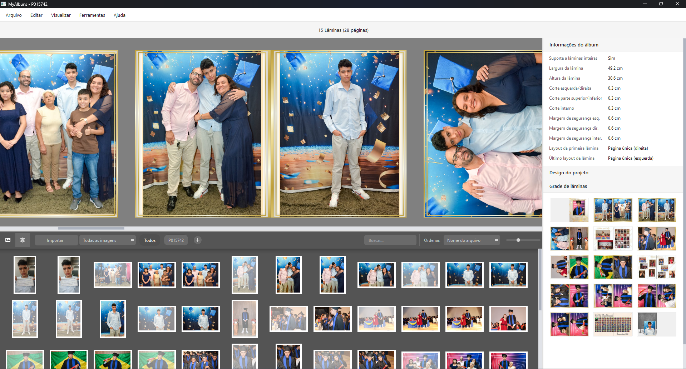
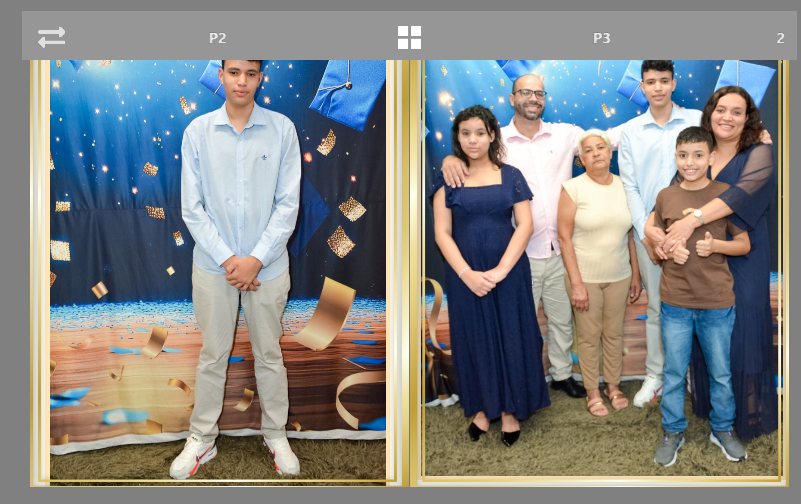
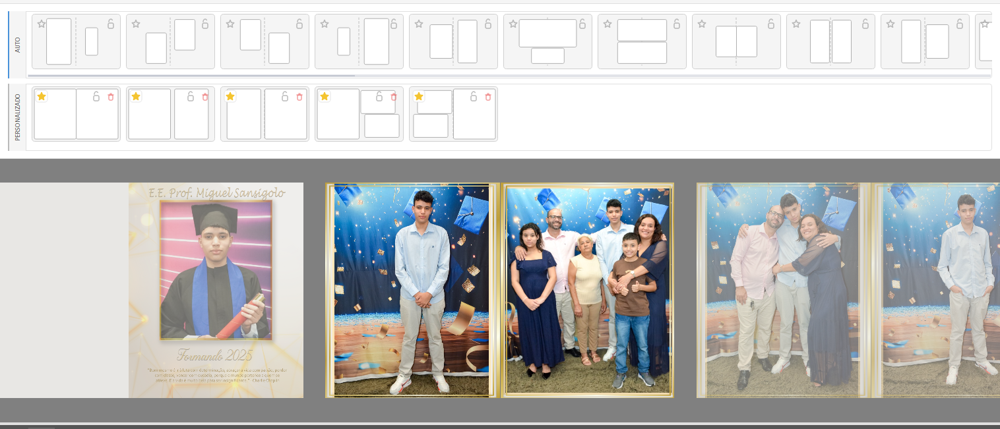

# Estrutura da Janela do Projeto

**Referência visual:** [imagem fornecida pelo autor](../assets/referencia-layout-editor.png)

**Referências complementares:** [barra da Lâmina](../assets/referencia-barra-da-lamina.png) · [Painel de Layouts horizontal](../assets/referencia-painel-de-layouts-horizontal.png)



## Objetivo

Manter a composição do Álbum como foco principal, permitir navegação contínua entre Lâminas e concentrar ferramentas em duas regiões persistentes: o Painel de imagens na parte inferior e um Painel contextual à direita.

A referência fixa a organização espacial, não o estilo visual final, as cores ou o tamanho exato de cada região.

## Estrutura-base

```text
┌──────────────────────────────────────────────────────────────────────────────┐
│ Menu: Arquivo | Editar | Lâmina | Exibir | Ferramentas | Ajuda              │
├──────────────────────────────────────────────────────────┬───────────────────┤
│                                                          │                   │
│ Canvas contínuo de Lâminas                               │ Painel contextual │
│ Lâmina 1   Lâmina 2   Lâmina 3   ...                    │ com seções        │
│ navegação horizontal contínua                            │ recolhíveis       │
│                                                          │ e rolagem própria │
├──────────── splitter horizontal redimensionável ─────────┤                   │
│ Painel de imagens                                        │                   │
│ Fotos | Decorativos · importar · buscar · filtrar        │                   │
└──────────────────────────────────────────────────────────┴───────────────────┘
                                                           ↑
                                         splitter vertical redimensionável
```

Não existe um navegador lateral independente de Lâminas. A visão contínua fica no Canvas, e a Grade de Lâminas do Painel contextual oferece a visão geral e o acesso rápido.

## Menu superior

A Janela usa uma barra de menus desktop convencional. Os grupos inicialmente previstos são:

- `Arquivo`;
- `Editar`;
- `Lâmina`;
- `Exibir`;
- `Ferramentas`;
- `Ajuda`.

`Ferramentas > Configurações` solicita ao processo principal a abertura da janela global de Configurações. Se ela já estiver aberta por outra Janela de Projeto ou pela Tela de Boas-vindas, a mesma instância é apenas focalizada.

No Modo de edição, `Editar` oferece `Copiar` e `Colar` para Frames, com os atalhos fixos do MVP `Ctrl + C` e `Ctrl + V`. `Copiar` exige ao menos um Frame selecionado; `Colar` exige conteúdo de Frame copiado e fica desabilitado quando a Lâmina possui Layout travado.

O menu `Lâmina` contém `Adicionar antes`, `Adicionar depois`, `Duplicar Lâmina`, `Excluir` e `Converter extremidade`. Esses comandos usam a Lâmina mais centralizada no Canvas como alvo implícito.

Os mesmos comandos aparecem no menu de contexto da superfície e da Barra de cada Lâmina, usando a Lâmina clicada como alvo explícito. `Converter extremidade` fica disponível somente quando o alvo é uma extremidade e a conversão produz uma estrutura válida.

No Modo de edição, o menu `Lâmina` continua visível, mas `Adicionar antes`, `Adicionar depois`, `Duplicar Lâmina`, `Excluir` e `Converter extremidade` ficam desabilitados. Barra e Grade não oferecem reordenação nesse modo; o usuário retorna ao Canvas contínuo com `Esc` antes de alterar a sequência.

`Adicionar antes` e `Adicionar depois` criam uma Lâmina dupla vazia, sem Frames ou Layout e com Background/Overlay herdados dos padrões atuais do Projeto. Se a inserção ocorrer para fora de uma extremidade dupla, a nova Lâmina assume esse papel; um comando que empurraria uma extremidade de Página única para o interior fica desabilitado.

Após inserir, a Numeração de Página é recalculada e o Canvas rola para centralizar a nova Lâmina. A inserção inteira entra como uma única ação de Undo/Redo; o deslocamento do Canvas não pertence ao Histórico.

`Duplicar Lâmina` insere imediatamente depois da original uma cópia independente de toda a composição: Background, Overlay, Frames, Fotos ou placeholders, estilos, ajustes, ordem visual, Último Layout aplicado e estado de Layout travado. Os itens reutilizam os mesmos vínculos externos, sem copiar os Arquivos originais, e alterações posteriores em uma Lâmina não atingem a outra.

O comando fica indisponível para uma extremidade de Página única, cuja cópia ocuparia o interior do Álbum. Após uma duplicação válida, papéis e Numeração são recalculados, a nova Lâmina é centralizada e toda a operação forma uma única ação de Undo/Redo; a centralização permanece fora do Histórico.

`Excluir` fica desabilitado quando o Álbum possui somente duas Lâminas. Nos demais casos, remove a Lâmina sem confirmação como uma única ação de Undo/Redo; Fotos e Decorativos importados continuam no Painel de imagens, mesmo quando perdem seu último uso.

Depois da exclusão, papéis e Numeração são recalculados. O Canvas centraliza a Lâmina seguinte ou, se a última foi excluída, a anterior. Um Painel de Layouts direcionado à Lâmina removida é fechado. Esses ajustes da interface não entram no Histórico, embora o Undo restaure integralmente a Lâmina e sua composição.

### Reordenação das Lâminas no Canvas

Pressionar uma área livre da Barra da Lâmina e mover além do limiar padrão de arraste inicia a reordenação. Os botões da Barra continuam reservados às próprias ações e não iniciam o gesto.

Durante o arraste:

- a posição de origem conserva um espaço reservado com as mesmas dimensões da Lâmina;
- um fantasma visual da Lâmina acompanha o ponteiro;
- quando o arraste alcança outra Lâmina válida, o espaço reservado muda para essa posição;
- as Lâminas entre a origem e o novo espaço deslizam uma posição para preencher a sequência;
- ao mover uma Lâmina posterior para uma posição anterior, os itens atingidos avançam para trás na sequência;
- ao mover uma Lâmina anterior para uma posição posterior, os itens atingidos avançam para frente na sequência.

Quando o fantasma entra na zona próxima à borda esquerda ou direita do Canvas, a visualização rola horizontalmente na direção correspondente. A velocidade cresce progressivamente conforme o ponteiro se aproxima da borda, e o espaço reservado continua acompanhando as posições reveladas pela rolagem.

O comportamento representa inserção na posição do espaço reservado, não troca direta com a Lâmina sob o ponteiro. Nenhuma ordem do Projeto é alterada durante a prévia. Soltar confirma a posição atual como uma única ação de Undo/Redo; `Esc` ou uma soltura inválida devolve imediatamente todos os itens à ordem original.

Se o gesto começou no Canvas, somente o Canvas anima a prévia e a Grade conserva a ordem confirmada. Se começou na Grade, somente ela anima e o Canvas permanece estável. A representação oposta é sincronizada de uma vez após a soltura válida e não muda em um cancelamento.

Posições que deslocariam uma Página única para o interior são inválidas e não recebem o espaço reservado. Depois de uma soltura válida, papéis e Numeração são recalculados e a Lâmina movida fica centralizada no Canvas; essa centralização não integra o Histórico.

Os comandos exatos e seus atalhos serão definidos no mapa de fluxos. A barra de menus não substitui controles contextuais dentro dos painéis.

## Canvas contínuo

- Ocupa a região superior da coluna de trabalho, desde a borda esquerda até o Painel contextual.
- Começa diretamente abaixo da barra de menus e comandos, sem uma faixa permanente de título, contagem ou ajuda sobre os gestos.
- Apresenta as Lâminas lado a lado em uma sequência horizontal contínua.
- Permite percorrer o Álbum sem trocar para uma tela separada por Lâmina.
- Mantém todas as Lâminas no modelo lógico, sem máximo arbitrário, mas materializa a cena detalhada e suas texturas somente para a área visível e uma margem de pré-carga adjacente.
- Lâminas fora dessa faixa preservam seu estado lógico enquanto liberam recursos gráficos pesados; retornar à faixa reconstrói a representação sem modificar o Projeto.
- No modo normal, todas as Lâminas apresentadas permanecem interativas; não existe uma única Lâmina ativa exclusiva.
- Arrastar uma Foto do Painel de imagens usa a Lâmina sob o ponteiro como destino.
- Fora do Modo de edição, `Alt` + clique e arraste sobre um Frame aplica Pan à Foto contida nele; `Alt` + roda do mouse sobre o Frame altera o Zoom da Foto. Ambos integram a `MediaTransform` persistente da colocação.
- Para o Pan, o usuário mantém `Alt`, pressiona sobre o Frame e inicia o arraste; o clique modificado é consumido pelo gesto e não seleciona o Frame. `Alt` + roda também preserva a seleção atual.
- Enquanto o Pan estiver ativo, a porção da Foto fora do Frame aparece temporariamente com opacidade reduzida, a porção interna permanece com opacidade normal e quatro linhas-guia da regra dos terços são exibidas dentro do Frame. Esses auxílios desaparecem ao terminar o gesto e não integram o Projeto, o Histórico ou a Exportação.
- Durante a prévia contínua de Pan ou Zoom, os valores correspondentes no Painel contextual acompanham imediatamente cada atualização do gesto. A prévia é transitória, volta aos valores confirmados em um cancelamento ou falha e não cria ações intermediárias no Histórico.
- Esses gestos atuam na Foto sob o ponteiro sem mover ou redimensionar o Frame e sempre respeitam o Preenchimento do Frame.
- Um arraste completo cria uma única ação de Undo/Redo ao soltar. Passos consecutivos de `Alt` + roda são agrupados em uma ação quando a sequência de rolagem termina.
- Selecionar um Frame ou Foto em qualquer Lâmina troca a seleção para aquele elemento e atualiza o contexto à direita.
- Clicar em uma área vazia remove a seleção do elemento e retorna ao contexto geral do Álbum, sem desativar nenhuma Lâmina.
- Clicar na Grade de Lâminas ou usar as setas de navegação leva o Canvas até outra Lâmina, mas não torna as demais inativas. Arrastar uma miniatura da Grade inicia a reordenação estrutural descrita para a Barra.
- Apenas percorrer o Canvas por rolagem não troca o conteúdo do Painel contextual.
- A Lâmina cujo centro visual está mais próximo do centro horizontal da área visível é a `Lâmina centralizada no Canvas`.
- Essa referência é recalculada durante a navegação e permanece independente da Lâmina ou do Frame em foco. Ela não cria uma seleção exclusiva; apenas fornece o destino para comandos que não receberam um alvo pelo ponteiro, inclusive o duplo clique em uma mídia no Painel de imagens.
- O Canvas não depende de uma coluna lateral de thumbnails.
- O modo normal do Canvas contínuo não oferece Zoom.
- Todas as Lâminas usam a mesma escala automática, calculada para que a altura completa caiba no Canvas com margem visual ao redor.
- O modo normal não possui rolagem vertical; a navegação entre Lâminas é exclusivamente horizontal.
- A navegação horizontal é limitada nas extremidades: o centro da primeira e o centro da última Lâmina podem alcançar o centro visível do Canvas, mas nunca ultrapassá-lo em direção à borda oposta.
- Redimensionar a Janela ou mover o splitter entre Canvas e Painel de imagens sincroniza primeiro a superfície do renderizador com a nova área útil e então recalcula a escala automática, mantendo a Lâmina inteira visível sem criar estado de Zoom.

A margem exata e a centralização da escala continuam abertas. A largura da pré-carga, a residência de texturas e os gatilhos de descarte serão definidos por testes de estresse com Álbuns longos.

### Barra da Lâmina e Painel de Layouts



Cada Lâmina possui uma barra própria imediatamente acima de sua superfície. A barra é parte exclusiva da interface, acompanha visualmente a largura da Lâmina e nunca aparece na Exportação.

A Barra e o Painel de Layouts pertencem exclusivamente ao Canvas contínuo do modo normal. Ambos ficam ausentes e indisponíveis no Modo de edição da Lâmina.

Quando o Painel estava aberto antes da entrada no Modo de edição, ele é apenas ocultado: seu alvo e estado aberto ficam suspensos. Ao sair com `Esc`, a faixa reaparece para a mesma Lâmina, mas sua lista é recalculada antes da exibição para refletir quantidade e geometria atuais. Se o Painel estava fechado, não é aberto automaticamente.

Na Lâmina dupla, `P2`, `P3` e rótulos equivalentes mostram a Numeração de Página de cada lado ativo. O número alinhado à direita identifica a posição da Lâmina no Álbum.

O controle de duas setas troca de lado os Frames: os pertencentes à Página esquerda passam para a direita e os pertencentes à direita passam para a esquerda. A ação afeta Frames e as Fotos contidas neles, não troca a Numeração de Página.

Para cada Frame totalmente contido em uma Página, a troca preserva sua posição relativa dentro da Página e apenas translada sua geometria para o lado oposto. Largura, altura, Foto, Pan, Zoom, estilo e posição na Pilha visual permanecem iguais; nem o Frame nem a Foto são espelhados.

Frames com Travessia central permanecem inalterados. A ação fica indisponível em Página única e em Layout travado e gera uma única ação de Undo/Redo.

O controle central em forma de grade abre ou fecha o Painel de Layouts para aquela Lâmina. O clique fornece um alvo explícito: não depende da Lâmina centralizada no Canvas nem cria uma Lâmina ativa exclusiva para os demais comandos.



O Painel de Layouts é uma única faixa horizontal compartilhada:

- ocupa a largura disponível da coluna de trabalho e termina antes do Painel contextual direito;
- aparece acima do conteúdo do Canvas e desloca as Lâminas para baixo, sem cobri-las;
- permanece associado à Lâmina cujo controle central o abriu;
- clicar novamente no mesmo controle fecha a faixa;
- clicar no controle de outra Lâmina mantém apenas uma faixa aberta e troca seu alvo;
- não aparece como seção do Painel contextual direito.

A faixa contém duas seções horizontais:

- `Automáticos`, com os Layouts produzidos pelo Gerador de Layouts;
- `Personalizados`, com os Layouts criados pelo usuário e disponíveis globalmente.

Clicar em uma preview aplica sua geometria; clicar no cadeado da preview aplica e trava no mesmo fluxo. Qualquer preview pode ser favoritada para o Projeto atual pela estrela. A estrela preenchida indica que existe uma cópia local independente, mas favoritar não move a preview entre as seções: a categoria continua representando a origem automática ou personalizada do Layout.

Passar o ponteiro sobre uma preview reorganiza temporariamente os próprios Frames da Lâmina alvo no Canvas. Fotos, placeholders, estilos, Bordas, Opacidade, Pilha visual, Pan, Zoom e demais ajustes permanecem visíveis e acompanham as novas posições e dimensões; o enquadramento usa o mesmo cálculo da aplicação definitiva.

Quando um candidato disponível apenas para travamento possui mais posições que os Frames atuais, as posições excedentes aparecem durante o hover como placeholders vazios transitórios, usando o Padrão de Frame herdado. Eles ainda não integram o Projeto, e clicar no corpo dessa preview não aplica a geometria; somente seu cadeado pode confirmá-la.

Essa representação não altera o Projeto, não marca mudanças pendentes e não cria Histórico. Sair da preview restaura imediatamente a composição anterior; passar para outra troca a geometria transitória. Clicar na preview confirma exatamente o resultado exibido, e clicar no cadeado confirma esse resultado, cria os placeholders excedentes e trava a organização, cada qual como uma única ação de Undo/Redo.

Previews em `Automáticos` possuem estrela e cadeado. Previews em `Personalizados` possuem também uma lixeira. Acioná-la abre uma confirmação e, se aceita, remove e persiste imediatamente somente a definição do catálogo global; Lâminas que já a aplicaram, Últimos Layouts aplicados e cópias favoritas dos Projetos permanecem inalterados. Essa exclusão não marca o Projeto e não entra em seu Undo/Redo.

Criações e exclusões substituem atomicamente a revisão do catálogo global. Cada Janela consulta a revisão vigente ao abrir o Painel de Layouts, receber foco ou solicitar atualização manual; broadcast imediato não é requisito do MVP. A atualização não altera a composição, não marca o Projeto receptor e não cria entrada em seu Histórico.

Clicar na estrela alterna favoritar/desfavoritar imediatamente, sem modal. A ação modifica o Projeto, entra no Undo/Redo e permanece pendente até `Salvar`. Desfavoritar remove somente a cópia favorita, sem tocar nas Lâminas aplicadas. Se a origem já não existir, a preview desaparece exceto quando a própria Lâmina alvo ainda a conserva como Último Layout aplicado.

Dentro de cada seção, o Último Layout aplicado aparece primeiro quando pertence àquela categoria e continua compatível; em seguida aparecem os favoritos do Projeto e os demais candidatos. A mesma definição nunca ganha uma segunda preview apenas por ser a última aplicada ou estar favoritada.

Quando uma operação precisa selecionar um Layout sem clique explícito do usuário, a ordem global é: Último Layout aplicado compatível, primeiro favorito, primeiro personalizado e primeiro automático.

Quando a Lâmina alvo possui Layout travado, a preview aplicada permanece destacada e mostra o cadeado fechado. As demais previews ficam visualmente desabilitadas e não podem ser acionadas. Clicar no cadeado fechado da preview destacada destrava a Lâmina imediatamente, sem diálogo e sem alterar sua composição; as demais previews voltam a ficar disponíveis. Travar e destravar entram no Histórico e podem ser desfeitos ou refeitos.

### Modo de edição da Lâmina

- Isola somente a Lâmina escolhida, centralizada e ampliada no Canvas.
- Não exibe a Barra da Lâmina nem permite abrir o Painel de Layouts.
- Suspende temporariamente um Painel de Layouts que estivesse aberto e o restaura, atualizado e no mesmo alvo, ao sair com `Esc`; não abre um painel que estivesse fechado.
- Não permite adicionar, excluir, converter ou reordenar Lâminas; esses comandos estruturais permanecem desabilitados até a saída com `Esc`.
- É o único modo no qual o usuário pode aplicar Zoom à visualização da Lâmina.
- Cada entrada começa em `Ajustar Lâmina`, usando a maior escala que mantém a Lâmina inteira visível no Canvas.
- Sair do modo descarta o nível de Zoom; uma nova entrada começa novamente em `Ajustar Lâmina`.
- As demais Lâminas ficam temporariamente ocultas, sem alterar o Álbum.
- Ao entrar, um Frame previamente selecionado no modo normal permanece selecionado somente se pertencer à Lâmina isolada; nos demais casos, o modo começa sem Seleção de Frames.
- Sair com `Esc` limpa toda a Seleção de Frames antes de retornar ao Canvas contínuo.
- Os gestos diretos sobre os elementos manipulam Frames — seleção simples ou múltipla, movimento e redimensionamento — e não executam Pan ou Zoom da Foto.
- Um clique simples substitui a seleção pelo Frame atingido; `Ctrl` + clique adiciona ou remove esse Frame da seleção.
- Pressionar e mover além do limiar padrão de arraste da plataforma inicia movimento, não um clique: sobre um Frame já selecionado, preserva a seleção e move todo o grupo; sobre um Frame não selecionado, substitui a seleção somente por ele e o move.
- Se o ponteiro for solto antes de ultrapassar esse limiar, aplicam-se as regras normais de clique e `Ctrl` + clique.
- Quando vários Frames se sobrepõem no ponto clicado, somente o mais acima na Pilha visual responde ao clique simples ou ao `Ctrl` + clique. Não existe modificador ou ciclo de cliques para alcançar Frames encobertos.
- Clicar em uma área vazia limpa a seleção. A primeira versão não oferece Caixa de seleção de Frames.
- A Seleção de Frames é temporária da sessão de edição: não altera o Projeto, não participa de Undo/Redo e não é salva.
- Depois de Undo ou Redo, Frames selecionados que deixaram de existir são retirados da seleção; restaurar um Frame não o seleciona novamente.
- Na seleção múltipla, cada Frame mantém seu contorno de seleção e uma Caixa delimitadora única envolve o conjunto.
- Arrastar o corpo de qualquer Frame selecionado move todos os selecionados juntos, preservando suas distâncias relativas.
- A Caixa delimitadora possui oito alças: quatro laterais, que escalam somente um eixo, e quatro nos cantos, que escalam largura e altura de forma independente.
- Durante o redimensionamento, o lado ou canto oposto permanece como âncora e as posições e dimensões de todos os Frames são escaladas proporcionalmente dentro da Caixa.
- O gesto para no último resultado válido antes de inverter a Caixa, ultrapassar a superfície ativa ou reduzir qualquer Frame abaixo do tamanho mínimo. O valor mínimo será calibrado no protótipo.
- `Shift` durante o arraste de uma alça de canto preserva a proporção da Caixa delimitadora.
- `Alt` em qualquer alça redimensiona a partir do centro, substituindo a âncora no lado ou canto oposto.
- `Shift + Alt` em uma alça de canto combina proporção preservada e redimensionamento central.
- Os modificadores respondem dinamicamente ao serem pressionados ou soltos durante o gesto e valem tanto para um único Frame quanto para seleção múltipla.
- Movimento e redimensionamento limitam o grupo inteiro no ponto válido mais próximo quando qualquer Frame ultrapassaria a superfície ativa; nenhum elemento é limitado individualmente.
- A superfície válida é a Lâmina inteira quando dupla e somente a Página ativa em Página única.
- Um movimento ou redimensionamento coletivo completo gera somente uma ação de Undo/Redo, consolidada ao terminar o gesto.
- O Travamento de Layout pertence à Lâmina inteira. Como o Modo de edição isola uma única Lâmina, uma seleção não mistura Frames travados e destravados.
- Em uma Lâmina com Layout travado, seleção simples e múltipla continuam disponíveis. Contornos e Caixa delimitadora permanecem visíveis, mas as alças de redimensionamento são omitidas.
- Tentar arrastar uma seleção travada fornece feedback de bloqueio, não inicia movimento e não cria ação no Histórico. Substituir Fotos e editar Borda, Opacidade, Pan, Zoom, Giro, Ângulo, Espelhamento e efeitos continuam permitidos.
- `Trazer para frente`, `Avançar uma posição`, `Recuar uma posição` e `Enviar para trás` ficam disponíveis no menu de contexto do Frame e em `Editar > Organizar`.
- `Ctrl` + `]` executa `Avançar uma posição` e `Ctrl` + `[` executa `Recuar uma posição`; os comandos de levar aos extremos permanecem sem atalho próprio.
- Na seleção múltipla, `Avançar uma posição` e `Recuar uma posição` tratam cada sequência contígua de selecionados como um bloco e a trocam com o Frame não selecionado adjacente na direção escolhida.
- Um bloco selecionado que já esteja no limite permanece no lugar, sem impedir que outros blocos da mesma seleção se movimentem.
- `Trazer para frente` e `Enviar para trás` reúnem todos os selecionados em um único bloco no extremo correspondente.
- Todos os quatro comandos preservam a ordem relativa entre os selecionados e entre os não selecionados. Cada comando completo é uma única ação de Undo/Redo e continua permitido em Layout travado.
- Como regra geral, todo comando invocado sobre uma Seleção de Frames atua em todos os elementos compatíveis e gera uma única ação de Undo/Redo; restrições específicas continuam sendo respeitadas.
- Quando exatamente dois Frames estão selecionados e ao menos um contém Foto, `Editar > Trocar conteúdo dos Frames` e o mesmo comando no menu de contexto ficam disponíveis. Dois placeholders mantêm a ação desabilitada.
- Com duas Fotos, suas ocorrências completas trocam de Frame. Com uma Foto e um placeholder, a Foto é movida para o Frame vazio e o Frame de origem torna-se placeholder.
- Geometria, estilo e posição permanecem com cada Frame. A Foto leva seu Arquivo vinculado e todos os ajustes; se a nova geometria exigir, o enquadramento é limitado somente no necessário para impedir áreas vazias.
- A troca funciona em Layout travado porque não altera quantidade, posição ou dimensões dos Frames, e constitui uma única ação de Undo/Redo.
- `Copiar` captura todos os Frames selecionados com suas geometrias, ordem relativa, Fotos ou placeholders, estilos e ajustes não destrutivos. A cópia não modifica o Projeto nem cria entrada no Histórico.
- A cópia permanece disponível quando o usuário sai da Lâmina de origem e entra no Modo de edição de outra Lâmina do mesmo Projeto; a Lâmina atualmente isolada é sempre o destino da colagem.
- Na Lâmina de origem, o deslocamento efetivo de `Colar` é o menor entre o deslocamento visual desejado e o que mantém todo o conjunto na superfície ativa. Se nenhum deslocamento for viável, as cópias ficam na mesma posição, tornam-se a seleção atual e entram acima dos originais na Pilha visual por ordem determinística. Em outra Lâmina com a mesma superfície, preservam as posições originais.
- Quando o destino é uma Página única e a superfície de origem é diferente, `Colar` mapeia proporcionalmente as posições e dimensões do conjunto inteiro para a Página ativa. As relações entre Frames, suas Fotos ou placeholders, a ordem, os estilos e os ajustes são preservados.
- Ao colar de uma Página única em uma Lâmina dupla, o conjunto é mapeado proporcionalmente somente para a Página do mesmo lado lógico: direita na direita e esquerda na esquerda. A composição nunca é ampliada automaticamente para ocupar a Lâmina inteira.
- Em ambos os destinos, `Colar` preserva as relações internas do conjunto e reutiliza os vínculos com os mesmos Arquivos originais, sem copiar mídia ou Cache.
- Depois da colagem, somente as novas ocorrências ficam selecionadas. A operação inteira gera uma única ação de Undo/Redo.
- A área de transferência de Frames pertence à Janela do Projeto. Uma cópia feita em uma Janela não habilita `Colar` em outra e não cria relação entre os dois Projetos.
- Em Layout travado, `Copiar` continua disponível, mas `Colar` fica desabilitado porque alteraria a quantidade de Frames.
- `Delete` e `Excluir` no menu de contexto removem, sem confirmação, todos os Frames selecionados e suas Fotos quando o Layout está destravado; os Frames restantes preservam suas geometrias.
- Em Layout travado, a mesma ação remove somente as Fotos, mantém os Frames como placeholders e não altera placeholders já vazios.
- O menu de contexto de um Frame preenchido oferece `Abrir no Photoshop`. A ação envia somente o Arquivo vinculado original da Foto, sem aplicar seu enquadramento ou efeitos do MyAlbuns; o atalho fixo do MVP é `Ctrl + E`.
- `Abrir no Photoshop` exige exatamente uma Foto contextual. Quando houver vários Frames selecionados, o comando e seu atalho ficam indisponíveis e nunca abrem vários arquivos em massa.
- `Editar > Adicionar Frame` e `Adicionar Frame` no menu de contexto da área vazia do Canvas criam imediatamente um único placeholder centralizado e selecionado.
- O Frame novo usa dimensões proporcionais à superfície ativa, nunca um tamanho físico fixo. Em Lâmina dupla, é centralizado na Lâmina inteira e pode atravessar a divisão; em Página única, é centralizado somente na Página ativa.
- Não existe modo de desenho nem ferramenta persistente para essa criação. O comando gera uma ação de Undo/Redo e fica indisponível em Layout travado.
- Painel contextual e Painel de imagens continuam disponíveis.
- O Painel de imagens assume automaticamente uma altura compacta para priorizar o Canvas, sem ser completamente ocultado.
- A altura normal anterior não é sobrescrita; ao sair, ela é restaurada.
- Encerrar o modo retorna ao Canvas contínuo na mesma posição de navegação anterior.
- Dois cliques em uma Lâmina entram no modo para aquela Lâmina.
- Com o foco no Canvas, `Enter` entra no modo para a Lâmina centralizada.
- `Esc` encerra o modo e retorna ao Canvas contínuo.

Não existe faixa, rótulo, botão de retorno ou mudança adicional de fundo para identificar o modo. O isolamento da única Lâmina, o aumento do Canvas e a redução do Painel de imagens são a indicação visual suficiente.

O Zoom do Modo de edição é estado temporário da interface: não altera o Projeto, não participa de Undo/Redo e não é salvo.

Durante o Modo de edição, a `ViewportTransform` temporária pode alterar o Zoom somente por `Ctrl` + `+`, `Ctrl` + `−` e `Ctrl` + roda do mouse. `Ctrl` + `0` retorna para `Ajustar Lâmina`. Não existem slider, botões ou percentual permanente.

`Ctrl` + roda mantém sob o cursor o ponto da Lâmina que estava naquela posição. `Ctrl` + `+` e `Ctrl` + `−` usam como âncora o centro visível do Canvas.

Quando o Zoom ultrapassa `Ajustar Lâmina`, `Espaço` + arraste com o botão esquerdo ou arraste com o botão do meio executam Pan do Canvas dentro da mesma `ViewportTransform`. O cursor assume a forma de mão e o gesto nunca move Frame ou Foto, não participa de Undo/Redo e não integra o Projeto.

`Ajustar Lâmina` é o limite mínimo: o usuário não pode reduzir a visualização abaixo do enquadramento completo. O limite máximo será calibrado no protótipo conforme nitidez e desempenho.

## Painel de imagens

- Ocupa a região inferior da coluna de trabalho e termina antes do Painel contextual.
- Um splitter horizontal entre Canvas e Painel de imagens permite alterar sua altura.
- `Exibir > Painel de imagens` recolhe ou restaura completamente a região; quando recolhida, o Canvas usa a altura disponível.
- Mantém as abas já definidas `Fotos` e `Decorativos`.
- `Importar` abre um menu com `Arquivos...` e `Pasta...`. `Arquivos...` usa o seletor do Windows com seleção múltipla; `Pasta...` importa somente imagens diretamente contidas na pasta escolhida, sem visitar subpastas.
- Seletores e arraste aceitam os caminhos locais, UNC, mapeados e longos definidos pela [política de caminhos](0011-resolucao-e-politica-de-caminhos.md). Cada importação usa um contexto temporário próprio e nunca resolve rede na thread da interface.
- Arquivos e pastas também podem ser arrastados do sistema operacional e soltos em qualquer área livre ou de grade do Painel. Pastas arrastadas seguem a mesma importação não recursiva de `Pasta...`.
- Todo item é classificado conforme a aba ativa no início da importação; no arraste, vale a aba ativa no momento da soltura.
- Em uma operação com vários arquivos, os válidos entram normalmente mesmo quando outros falham. Formatos incompatíveis, arquivos inválidos ou corrompidos são ignorados sem reverter os sucessos; duplicatas não contam como falha.
- Se houver rejeições, a Tela de Problemas é aberta ao final com as colunas `Arquivo` e `Motivo`.
- Todos os novos itens aceitos por uma seleção, uma pasta ou uma única soltura formam uma ação de Undo/Redo e deixam o Projeto alterado. Desfazer remove somente esses vínculos do Painel; refazer os restaura. Arquivos originais e duplicatas preexistentes nunca são afetados.
- Se a operação não criar nenhum item novo, ela não adiciona uma entrada ao Histórico nem marca alterações pendentes.
- Contém os controles de busca, ordenação e Filtro de uso já especificados.
- A busca filtra a grade em tempo real pelo Nome do arquivo, ignorando maiúsculas, minúsculas e acentos, e atua somente na aba atualmente visível.
- Busca e demais filtros formam uma interseção: por exemplo, `Não usadas` com um texto mostra apenas os itens que atendem às duas condições. A Ordenação escolhida continua determinando a sequência dos resultados.
- `Fotos` e `Decorativos` conservam textos de busca independentes enquanto a Janela do Projeto estiver aberta. Um `X` dentro do campo limpa somente o texto da aba atual.
- O texto buscado é estado temporário da Janela: não altera o Projeto, não participa de Undo/Redo e não volta na sessão seguinte.
- Um slider único na barra do Painel ajusta continuamente o tamanho das miniaturas da aba ativa. A grade se reorganiza em tempo real durante o gesto.
- Cada miniatura preserva a proporção inteira da imagem, sem corte. Dois cliques no slider restauram o tamanho médio padrão, seguindo a convenção geral dos sliders do aplicativo.
- `Fotos` e `Decorativos` guardam tamanhos independentes como preferências globais do usuário, reutilizadas entre Projetos e sessões e sem efeito no Projeto ou em Undo/Redo.
- Mínimo, máximo e tamanho médio exatos serão calibrados no protótipo.
- Um clique simples seleciona somente a mídia acionada e a torna a âncora da seleção; `Ctrl` + clique adiciona ou remove itens individualmente.
- `Shift` + clique seleciona o intervalo contínuo entre a âncora e o item acionado na ordem atualmente visível, já considerando Busca, filtros e Ordenação.
- `Ctrl + A` seleciona somente todos os itens atualmente visíveis na aba ativa. Itens ocultos pela Busca ou pelos filtros permanecem fora da seleção e de qualquer ação em lote subsequente.
- Se uma mudança na Busca ou nos filtros ocultar itens já selecionados, eles são retirados imediatamente da seleção; os que permanecem visíveis continuam selecionados. Uma âncora ocultada também é descartada.
- Alterar somente a Ordenação preserva os mesmos itens selecionados e a mesma âncora, acompanhando suas novas posições na grade.
- O clique direito sobre uma mídia já selecionada preserva toda a seleção antes de abrir o menu de contexto. Sobre uma mídia não selecionada, substitui a seleção somente por ela.
- Com o foco no Painel, `Delete` e o comando contextual `Remover` atuam sobre a seleção resultante. O mesmo atalho continua obedecendo ao contexto do Canvas quando o foco não está no Painel.
- Não existe Caixa de seleção no Painel. Arrastar ou dar dois cliques atua somente sobre a mídia diretamente acionada e nunca insere toda a seleção múltipla na Lâmina.
- A seleção do Painel é estado transitório da interface e não pertence ao Projeto ou ao Undo/Redo.
- Remover uma seleção de Fotos sem uso retira diretamente os itens do Painel. Se ao menos uma estiver em uso, um único diálogo consolidado oferece `Remover tudo`, `Remover imagens e manter os Frames` e `Cancelar`, aplicando a escolha à seleção inteira.
- `Remover tudo` exclui os Frames destravados que usam as Fotos selecionadas e preserva como placeholders os pertencentes a Layouts travados. `Remover imagens e manter os Frames` esvazia todas as ocorrências e preserva todos os Frames afetados.
- Para Decorativos, um único item sem uso pode ser removido diretamente; um item em uso ou uma seleção múltipla abre uma única confirmação conjunta.
- Cada remoção confirmada, inclusive em lote, forma uma única ação de Undo/Redo. Nenhuma opção modifica ou exclui os Arquivos originais.
- Exibe as mídias em uma grade de previews sem substituir o Canvas.
- A grade começa no canto superior esquerdo, distribui as mídias por colunas e continua em novas linhas conforme a largura disponível. Quando a altura não comporta todas as linhas, somente a rolagem vertical é usada.
- A área rolável reserva permanentemente a largura potencial da barra de rolagem para que previews e controles não mudem de posição quando ela aparece ou desaparece.
- O menu de contexto de uma Foto oferece `Abrir no Photoshop`, com o mesmo comando e atalho do Frame preenchido.
- Dois cliques em uma Foto usam a Lâmina centralizada no Canvas como alvo implícito; no Modo de edição, usam a única Lâmina isolada.
- Se o alvo implícito possuir placeholders, o duplo clique preenche o mais à esquerda sem alterar sua geometria. Sem placeholder, cria um novo Frame conforme as regras do modo: primeiro Layout compatível no modo normal e Frame centralizado proporcional no Modo de edição.
- `Mais à esquerda` significa a menor coordenada da borda esquerda; se houver empate, prevalece o placeholder cuja borda superior estiver mais acima.
- Em Layout travado sem placeholder, o duplo clique não modifica o Projeto e informa que a Foto precisa ser arrastada para um placeholder disponível.
- Arrastar uma Foto diretamente sobre um Frame, esteja vazio ou preenchido, define o único alvo da operação: preenche ou substitui sua Foto sem afetar os demais Frames selecionados. Essa substituição explícita também é válida em Layout travado porque preserva a estrutura do Frame.
- Quando retângulos de Frames se sobrepõem sob o ponteiro, somente o mais acima na Pilha visual pode ser alvo da Foto, independentemente de estar vazio, transparente ou com Opacidade reduzida. Não existe gesto de alternância para atingir um Frame inferior.
- No Modo de edição, soltar uma Foto em área vazia cria um Frame com a mesma proporção padrão de `Adicionar Frame`, centralizado no ponto de soltura. Se ultrapassaria a borda, o Frame inteiro é deslocado para o interior sem ser reduzido.
- No modo normal, a área vazia escolhe somente a Lâmina; o primeiro Layout compatível define a posição do novo Frame. Em Layout travado, áreas vazias não são alvos válidos.
- Durante o arraste de Foto, somente o Frame superior determinado pelo seu retângulo externo recebe destaque visual de alvo. Uma área vazia válida destaca somente a Lâmina correspondente.
- O arraste não compõe uma prévia da Foto, não desenha antecipadamente o novo Frame e não mostra a reorganização do Layout. Alvos inválidos usam feedback de bloqueio.
- `Esc` ou a soltura fora de um alvo válido encerra o arraste sem alterar o Projeto ou o Histórico; somente a soltura válida executa a operação.
- Depois de preencher, substituir ou criar, somente o Frame afetado fica selecionado e o Painel contextual passa a mostrar sua Foto. Essa mudança de seleção não constitui uma ação adicional de Undo/Redo.
- Dois cliques em um Decorativo aplicam-no como Background a Ambos os lados da Lâmina centralizada; manter `Shift` durante os dois cliques aplica-o como Overlay. No Modo de edição, o destino é Ambos os lados da Lâmina isolada.
- O duplo clique em Decorativo não escolhe um lado individual; aplicações à esquerda ou à direita exigem arrastar até o alvo correspondente.
- Arrastar e soltar continua escolhendo explicitamente a Lâmina ou o Frame sob o ponteiro e prevalece sobre o destino implícito.
- Arrastar um Decorativo sem modificador aplica-o como Background; manter `Shift` pressionado durante o arraste muda o papel daquele uso para Overlay.
- Ao arrastar um Decorativo, cada Lâmina apresenta três alvos explícitos: lado esquerdo, região central para Ambos os lados e lado direito. A região central aplica o Decorativo aos dois lados ativos da mesma Lâmina, não a duas Lâminas distintas.
- O alvo de Ambos os lados é uma faixa proporcional ao redor da junção central, não somente a linha divisória. Ela aparece durante o arraste; as áreas restantes da superfície formam os alvos esquerdo e direito.
- O feedback do arraste destaca simultaneamente o papel atual (`Background` ou `Overlay`) e o escopo que receberá a soltura (`esquerda`, `Ambos os lados` ou `direita`). Alterar o estado do modificador atualiza esse feedback imediatamente.
- Além do destaque e do rótulo, o próprio Decorativo é renderizado temporariamente na zona de destino: abaixo dos Frames quando for Background e acima deles, preservando sua transparência, quando for Overlay. A prévia substitui visualmente apenas o uso que seria atingido pela soltura.
- A prévia de arraste não modifica o Projeto, não marca alterações pendentes e não cria Histórico. Somente uma soltura válida gera o comando; `Esc` ou a soltura fora de uma zona válida restaura a composição anterior sem Undo.
- Frames e Fotos não interceptam o arraste iniciado na aba `Decorativos`. Mesmo quando o ponteiro está sobre um deles, o alvo continua sendo a zona da Lâmina abaixo do ponteiro; o gesto não substitui a Foto, não preenche o Frame e não altera a seleção atual.
- Em Página única, o lado desativado não constitui alvo de soltura e a faixa central não é exibida. Arrastar sobre a Página ativa cria uma aplicação daquele lado.
- Dois cliques em um Decorativo continuam criando uma aplicação de Ambos os lados mesmo em Página única. Ela ocupa somente o lado ativo no estado atual e passa a cobrir ambos os lados se a Lâmina for convertida para dupla.
- A aplicação por arraste é uma personalização manual: altera para `custom` apenas o papel e o escopo atingidos e constitui uma única ação de Undo/Redo.
- Soltar em somente um lado nunca substitui o lado oposto. Se já houver uma aplicação de Ambos os lados, o uso é dividido logicamente e o lado não atingido preserva exatamente a aparência e a origem de herança anteriores, sem reesticar sua parte da imagem.
- Soltar na região central substitui as aplicações dos dois lados daquele papel por uma única aplicação `custom` de Ambos os lados. A conversão completa constitui uma única ação de Undo/Redo.

A altura e a visibilidade escolhidas são preferências da interface lembradas entre sessões. Não alteram o Projeto e não participam de Undo/Redo.

Arquivos vinculados usados pelos Projetos abertos são monitorados. Eventos sucessivos do mesmo caminho são agrupados e tratados apenas como indícios; uma inspeção autoritativa só ocorre quando o arquivo estiver estável e legível. Depois que ela confirma mudança externa, o `MediaRuntime` atualiza o estado observado, o `CacheEngine` invalida as prévias correspondentes e o Painel, os Frames e demais ocorrências abertas daquele caminho são atualizados automaticamente. Somente uma origem acessível que confirme a inexistência atualiza as representações para Arquivo ausente; falha de rede ou acesso inconclusivo produz Arquivo indisponível e preserva o vínculo. O retorno ao mesmo caminho restaura e reconstrói as prévias sem Religação. Essas transições não criam Histórico ou mudanças pendentes.

## Painel contextual direito

É uma única região reutilizável, fixa à direita, com rolagem vertical própria. Seu conteúdo é organizado em seções recolhíveis no padrão accordion.

O estado aberto ou fechado das seções é lembrado separadamente para os contextos do Álbum, de `Design da Lâmina` e de Frame/Foto. Ao retornar a um contexto, sua disposição anterior é restaurada.

Esses estados são preferências da interface reutilizadas entre Projetos e sessões; não pertencem ao Projeto e não participam de Undo/Redo.

A área de rolagem do Painel reserva permanentemente a largura potencial da barra vertical. Expandir ou recolher seções não desloca horizontalmente títulos, controles ou previews quando a barra aparece ou desaparece.

Um splitter vertical separa o Painel contextual da coluna formada conjuntamente por Canvas e Painel de imagens. Arrastá-lo altera a largura do Painel contextual sem permitir que ele cubra ou se sobreponha às duas regiões.

`Exibir > Painel contextual` oculta ou restaura completamente a região. Quando ocultada, Canvas e Painel de imagens usam toda a largura disponível. Largura e visibilidade são preferências da interface lembradas entre sessões; não alteram o Projeto nem participam de Undo/Redo.

### Contexto do Álbum

No Canvas contínuo, quando não existe um Frame ou uma Foto selecionada, o Painel apresenta:

1. `Informações do Álbum`;
2. `Design do Álbum`;
3. `Grade de Lâminas`.

`Grade de Lâminas` mostra previews compactos de todo o Álbum, serve como navegação rápida e também permite reordenar a sequência.

Cada preview é uma representação vetorial da `ComposedSheet` correspondente na projeção atual do Editor, nunca uma miniatura genérica. Ela preserva proporção, superfície, linha central, geometria e ordem dos Frames, recorte e transformação das Fotos, placeholders e Overlay. Uma nova projeção produzida pelo domínio atualiza Canvas e Grade a partir da mesma composição; o destaque de navegação permanece uma camada da interface externa à preview.

Um clique sem ultrapassar o limiar de arraste centraliza a Lâmina correspondente no Canvas. Ao arrastar uma miniatura, sua célula vira um espaço reservado, um fantasma da miniatura acompanha o ponteiro e as células intermediárias se deslocam na ordem linear do Álbum. Soltar confirma a mesma operação de inserção e Undo/Redo usada no Canvas; `Esc`, soltura inválida e posições que interiorizariam uma Página única restauram a grade original.

Nas bordas superior e inferior da área visível da Grade, o arraste inicia rolagem vertical automática do contêiner. A velocidade cresce com a proximidade da borda e as células continuam se reorganizando durante a rolagem.

Enquanto a Grade apresenta essa prévia, o Canvas mantém a última ordem confirmada até a soltura válida.

`Informações do Álbum` é uma visão somente de consulta. Ela mostra:

- quantidade atual de Lâminas e Páginas;
- dimensões da Lâmina e da Página, Unidade e DPI;
- formato da primeira e da última Lâmina;
- Sangria e Área de segurança;
- quantidade de Frames placeholder e Arquivos originais ausentes, distinguindo quantos ausentes estão em uso.

Frames placeholder e originais ausentes em uso são destacados como bloqueios de Exportação. Originais ausentes sem uso aparecem como aviso, sem impedir a saída. Nenhum valor é editado nessa seção.

Clicar em `Frames placeholder` expande a `Grade de Lâminas` e destaca as Lâminas afetadas. Clicar em `Originais ausentes` abre o Painel de imagens no filtro `Ausentes`; badges nas abas `Fotos` e `Decorativos` mostram quantos itens ausentes existem em cada categoria.

Quando `Ausentes` é aberto pelo aviso, o Painel guarda a aba e os filtros anteriores. Encerrar essa visualização restaura exatamente o estado anterior; o modo de diagnóstico não é persistido entre sessões nem substitui as preferências normais do Painel.

`Design do Álbum` centraliza todas as configurações globais editáveis do Projeto, e não somente Background e Overlay. Sua organização inicial é:

1. `Estrutura`: configuração das extremidades;
2. `Documento`: Unidade, largura e altura da Lâmina e DPI;
3. `Áreas técnicas`: valores de Sangria e Área de segurança;
4. `Padrões visuais`: Background e Overlay padrão, incluindo seus escopos;
5. `Padrão dos Frames`: presença, cor e espessura da Borda padrão.

Novas configurações globais devem ser incorporadas ao grupo correspondente ou justificar um novo grupo; ajustes exclusivos de uma Lâmina ou elemento não pertencem a essa seção.

`Quantidade de Lâminas` é um campo exclusivo do diálogo de criação e não aparece como configuração editável em `Design do Álbum`. Depois da criação, adicionar ou excluir Lâminas continua sendo uma ação estrutural explícita do editor, não a alteração de um valor global.

`Estrutura` contém somente os controles independentes `Primeira Lâmina` e `Última Lâmina`. Cada um permite escolher `Lâmina dupla` ou `Página única`. Seu `Aplicar` apresenta o impacto das conversões antes de executar atomicamente as alterações confirmadas.

Em `Documento`, trocar a Unidade converte imediatamente somente os valores exibidos, sem alterar tamanho físico ou pixels. Largura, altura e DPI permanecem pendentes até um único `Aplicar`, cuja confirmação apresenta o tamanho físico e a resolução final.

Dimensões e DPI são confirmados atomicamente em uma única ação de Undo/Redo. A transformação dimensional segue seus limites seguros; a parte de DPI altera a resolução em pixels das representações derivadas e da Exportação sem, por si só, mudar Frames, Pan ou enquadramentos. O resultado permanece não salvo até `Salvar`.

Em `Áreas técnicas`, os campos de Sangria e segurança usam a Unidade do Projeto. `Enter` ou a saída do campo confirma um valor válido, atualiza imediatamente máscara e guias e cria uma ação de Undo/Redo por campo. Valor inválido permanece sem aplicação e apresenta o erro no próprio campo; não existe botão `Aplicar` nem modal para esse grupo.

No topo de `Padrões visuais`, uma miniatura mostra somente a composição do padrão global do Álbum, sem representar uma Lâmina específica. Ela reutiliza a interação espacial de `Design da Lâmina`: hover e clique escolhem lado esquerdo, lado direito ou Ambos os lados pela região central. Background e Overlay aparecem abaixo e operam sobre o escopo selecionado.

Clicar no preview de imagem de Background ou Overlay abre um seletor compacto contendo somente os Decorativos já importados no Projeto. Escolher um item altera imediatamente o padrão correspondente, atualiza as aplicações que acompanham o design do Álbum e cria uma única ação de Undo/Redo.

O seletor não importa arquivos e não aceita arraste. A importação de novos Decorativos permanece exclusivamente no Painel de imagens.

`Padrão dos Frames` apresenta uma prévia simples de Frame e os controles `Exibir borda`, cor e espessura na Unidade do Projeto. Cada alteração entra imediatamente como uma ação de Undo/Redo e atualiza somente os Frames que usam o design do Álbum.

Opacidade não pertence ao padrão global e não aparece nesse grupo; ela permanece no contexto individual de Frame.

Não existe um botão geral `Salvar configurações`. Mudanças simples, como cor ou Borda padrão, alteram o estado do Projeto imediatamente e criam a ação de Undo/Redo correspondente. Mudanças estruturais ou dimensionais possuem `Aplicar` próprio, pré-validação e confirmação do impacto antes de entrarem atomicamente no Projeto.

Aplicar uma configuração nunca grava o arquivo automaticamente. Toda mudança continua pendente até o comando manual `Salvar`.

### Contexto da Lâmina

No Modo de edição, quando nenhum Frame ou Foto está selecionado, o Painel contextual direito troca para `Design da Lâmina`. Dentro dessa seção:

1. uma miniatura real e atualizada da Lâmina funciona como seletor espacial de escopo;
2. passar o ponteiro sobre o lado esquerdo ou direito realça somente aquele lado;
3. passar o ponteiro sobre a região central realça os dois lados, representando Ambos os lados;
4. clicar mantém o escopo realçado em estado visual de seleção, sem alterar a composição;
5. os controles de Background e Overlay aparecem abaixo da representação e operam sobre o escopo selecionado;
6. esses controles oferecem ações para remover a aplicação local ou voltar a usar o design definido para o Álbum.

Essa representação existe somente no Painel contextual direito. Ela não adiciona zonas permanentes, botões ou sobreposições ao Canvas.

Nem a miniatura nem os controles de Background e Overlay funcionam como alvos para Decorativos arrastados. A aplicação de imagens decorativas permanece concentrada no Canvas, por arraste ou duplo clique, evitando um segundo fluxo redundante no Painel contextual.

Abaixo da miniatura, o escopo selecionado possui:

- `Background`: preview da cor ou imagem atual, seletor de cor, `Remover` e `Voltar ao design do álbum`;
- `Overlay`: preview da imagem atual ou o estado `Sem overlay`, `Remover` e `Voltar ao design do álbum`.

Escolher uma cor define o Background local do escopo selecionado e constitui uma única ação de Undo/Redo. Trocar Background ou Overlay por uma imagem continua sendo feito no Canvas.

Cada controle mostra sempre `Usando o design do álbum` ou `Definido nesta lâmina`. `Voltar ao design do álbum` aparece somente quando houver uma definição local; não é exibido desabilitado para um valor que já acompanha o Álbum. `Remover` permanece disponível e afeta apenas o escopo selecionado: Background passa a branco e Overlay passa a ausente.

Quando o escopo `Ambos os lados` está selecionado e as Páginas possuem valores diferentes, cada controle mostra dois previews, identificados como `Esquerda` e `Direita`, com a origem amigável de cada lado. Qualquer alteração executada nessa seleção afeta os dois lados como uma única ação de Undo/Redo; para alterar somente um deles, o usuário precisa selecioná-lo na miniatura.

A miniatura acompanha a composição corrente da Lâmina. Os efeitos de hover e seleção são desenhados por cima dela e não fazem parte do conteúdo do Projeto, do Salvamento ou da Exportação.

Em Página única, a miniatura ainda representa a superfície física completa, mas o lado desativado aparece neutro e não responde a hover ou clique. Somente a Página ativa pode ser selecionada; a região central não seleciona os dois lados.

Ao entrar no Modo de edição, uma Lâmina dupla inicia com o escopo `Ambos os lados` selecionado; uma Página única inicia com sua Página ativa selecionada. Se um Frame ou Foto for selecionado e depois a seleção for limpa, `Design da Lâmina` restaura o último escopo escolhido naquela sessão de edição. Sair do Modo de edição descarta essa seleção.

A seleção da miniatura é estado temporário da interface: não altera o Projeto, não participa de Undo/Redo e não é persistida no arquivo.

`Design da Lâmina` oferece o botão `Salvar disposição como Layout`. O mesmo comando aparece em `Editar > Salvar disposição como Layout` e permanece disponível durante o Modo de edição mesmo quando a seleção de um Frame substitui temporariamente o contexto direito. A ação exige ao menos um Frame e é imediata: não pede nome, não abre modal, identifica o item pela própria preview, infere automaticamente se o Layout é por Página ou por Lâmina e o persiste no catálogo global sem sair do modo, aplicar outra geometria ou travar a composição. Por não alterar o Projeto, não cria mudanças pendentes nem entrada em seu Histórico.

Quando a Lâmina não possui Frames, o botão e o item de menu ficam desabilitados e informam que um Layout precisa de ao menos uma posição. Antes de salvar, a geometria é normalizada pela superfície. Só existe duplicata quando escopo, tipo e proporção de superfície, quantidade de Frames e sequência ordenada de posições e dimensões coincidem; uma ordem visual diferente representa outra identidade de Layout. Um aviso não modal informa `Este Layout já existe em Personalizados`. Como o Painel de Layouts não aparece no Modo de edição, a preview existente é rolada para a área visível e realçada brevemente na próxima abertura compatível do painel no modo normal.

Os estados internos `default` e `custom` não são exibidos literalmente ao usuário. O Painel usa:

- `Usando o design do álbum` quando a aplicação acompanha o padrão;
- `Definido nesta lâmina` quando existe uma definição local;
- `Voltar ao design do álbum` para eliminar a definição local e retomar o padrão atual.

### Contexto de Frame e Foto

Ao selecionar um Frame com Foto ou a Foto dentro dele, o Painel troca para ferramentas relacionadas ao elemento:

1. preview da imagem e informações do arquivo;
2. `Design`, incluindo Zoom, Ângulo, Opacidade e Borda;
3. `Ajustes e Efeitos`.

Na primeira versão, `Ajustes e Efeitos` contém somente a opção `Preto e branco`. Brilho, contraste, saturação e outros filtros não aparecem desabilitados ou como placeholders; novos controles entram apenas quando forem implementados.

`Ângulo` é o ajuste fino contínuo da Foto entre `-45°` e `+45°`. Ele é independente do comando de Giro de 90° anti-horário: os dois valores aparecem e podem ser redefinidos separadamente.

O controle de Ângulo combina slider e campo numérico, com precisão de `0,1°`. Não existe botão de restauração: dois cliques no slider retornam a `0°`. Essa é a convenção geral dos sliders da aplicação — dois cliques restauram o valor padrão definido para aquele controle. Quando o slider edita o Projeto, o reset participa de uma única ação de Undo/Redo; controles operacionais, como Qualidade JPEG, não alteram o Histórico.

A primeira versão permite selecionar vários Frames simultaneamente no Modo de edição com os gestos e as transformações coletivas definidos acima.

Quando vários Frames estão selecionados, o Painel contextual:

- apresenta um cabeçalho com a quantidade total de Frames e informa quantos contêm Foto e quantos são placeholders;
- não elege nem mostra o preview de uma Foto específica;
- mantém `Design` e `Ajustes e Efeitos`, exibindo somente propriedades aplicáveis em lote;
- mostra normalmente um valor numérico compartilhado por todos os elementos compatíveis;
- mostra `—` quando os valores numéricos diferem, como estado indeterminado sem sugerir valor zero nem alterar os valores reais;
- quando valores binários diferem, mostra um estado neutro que não indica ligado nem desligado;
- quando cores diferem, mostra uma amostra vazia sem eleger uma das cores;
- nenhum estado neutro ou vazio altera os elementos até uma escolha explícita;
- ao primeiro ajuste de um controle divergente, aplica o novo valor absoluto igualmente a todos os elementos compatíveis como uma única ação de Undo/Redo.

As propriedades em lote respeitam o tipo do elemento:

- Borda e Opacidade são propriedades do Frame e atingem todos os Frames selecionados, inclusive placeholders;
- Zoom, Ângulo, Giro de 90°, Espelhamento e Preto e branco são propriedades da Foto e atingem somente os Frames selecionados que contêm Foto;
- quando apenas parte da seleção contém Foto, o Painel informa explicitamente o alcance, por exemplo `Aplicado a 3 Fotos de 5 Frames`;
- quando nenhum Frame selecionado contém Foto, os controles exclusivos de Foto ficam ocultos;
- cada alteração, ainda que alcance somente as Fotos compatíveis, constitui uma única ação de Undo/Redo.

## Regras confirmadas

- O Painel contextual muda de conteúdo; não abre outra janela para cada seleção.
- As seções internas podem ser expandidas ou recolhidas independentemente.
- A coluna de trabalho é formada pelo Canvas sobre o Painel de imagens.
- O Painel contextual não é coberto pelo Painel de imagens.
- A navegação principal pelas Lâminas é contínua e horizontal.
- O Modo de edição isola uma Lâmina e reduz temporariamente o Painel de imagens para ampliar o Canvas.
- No Modo de edição, a ausência de seleção de Frame/Foto mostra `Design da Lâmina`; selecionar um desses elementos substitui esse contexto pelo de Frame e Foto.
- A primeira versão não oferece comandos de alinhamento ou distribuição de Frames; a seleção múltipla não implica essas ferramentas.
- Termos internos de persistência e herança, como `default` e `custom`, nunca aparecem literalmente na interface.
- A imagem de referência é conceitual e não obriga a copiar seu estilo visual.

## Decisões ainda abertas

- margem e centralização exatas da escala automática do Canvas contínuo;
- limite máximo do Zoom exclusivo do Modo de edição, a ser calibrado no protótipo;
- largura proporcional exata da faixa central de soltura dos Decorativos, a ser calibrada no protótipo;
- proporção inicial exata do Frame placeholder criado manualmente.
