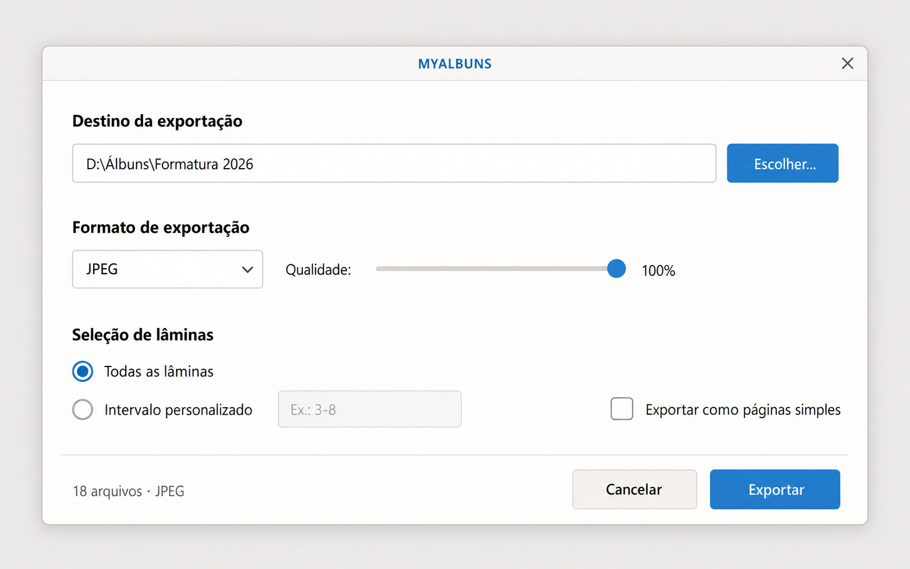

# Exportação normal

## Objetivo

A tela de Exportação reúne somente as decisões necessárias para gerar a saída final do Projeto aberto. Dimensões e DPI são herdados do Projeto e não podem ser substituídos nesse fluxo.

## Estrutura do diálogo

A Exportação normal usa um único diálogo modal com largura inicial de 800 px,
sem uma linha interna de título `Exportar`. A proposta abaixo foi aprovada
pelo usuário como refinamento da referência visual do projeto:



Os blocos têm títulos acima dos controles, margens laterais amplas e espaço
entre eles, na seguinte ordem:

1. `Destino da exportação`: campo de pasta e botão `Escolher…` na mesma linha;
2. `Formato de exportação`: seletor `JPEG`, `PNG` ou `PDF`, acompanhado do
   slider e percentual de qualidade quando o formato é JPEG;
3. `Seleção de lâminas`: opções exclusivas `Todas as lâminas` e
   `Intervalo personalizado`, uma abaixo da outra. O intervalo tem um único
   campo ao lado. Na mesma linha, à direita, fica a opção independente
   `Exportar como páginas simples`.

`Todas as lâminas` é o padrão. O campo de intervalo permanece desabilitado
nessa seleção e preserva o texto ao alternar. O intervalo aceita uma lâmina
(`3`) ou uma faixa contínua (`3-8`). Páginas simples desmarcado corresponde
à saída por lâmina; marcado corresponde à saída por página. Em janelas mais
estreitas, a opção de páginas simples passa para a linha seguinte.

O rodapé fixo apresenta a quantidade calculada de arquivos para JPEG/PNG ou de páginas para PDF, além de `Cancelar` e `Exportar`.

Na abertura, a pasta de destino padrão é obtida antes de apresentar o diálogo.
A janela aparece diretamente com os campos prontos para edição, sem um estado
transitório de preparação que altere sua altura. Se a consulta falhar, o diálogo
já abre editável com a mensagem de erro e permite escolher outra pasta.

```text
┌──────────────────────────────────────────────────────────────────┐
│  Destino da exportação                                          │
│  [ caminho calculado ou escolhido ]                [ Escolher ] │
│                                                                 │
│  Formato de exportação                                          │
│  [ JPEG ▾ ]    Qualidade: ─────────● 100%                         │
│                                                                 │
│  Seleção de lâminas                                             │
│  ● Todas as lâminas                                             │
│  ○ Intervalo personalizado [ 3-8 ]    □ Páginas simples          │
├──────────────────────────────────────────────────────────────────┤
│  28 arquivos                              Cancelar   Exportar     │
└──────────────────────────────────────────────────────────────────┘
```

## Qualidade

O slider de qualidade aparece somente quando `JPEG` está selecionado na Exportação normal. Trocar para PNG ou PDF remove o controle em vez de deixá-lo desabilitado.

Cada abertura do diálogo inicia o slider em qualidade máxima. Dois cliques no controle restauram imediatamente esse mesmo valor.

Qualidade é uma opção daquela operação: não modifica o Projeto, não marca alterações pendentes, não participa de Undo/Redo e não é carregada como preferência da próxima Exportação. A Exportação em lote não apresenta esse slider.

Quando o formato do lote é JPEG, a codificação usa obrigatoriamente qualidade máxima.

## Entrada contextual

`Exportar Lâmina`, acionado pelo menu de contexto, abre o mesmo diálogo com
`Intervalo personalizado` selecionado e o número da Lâmina de origem preenchido no
campo. Todas as demais opções continuam editáveis antes de iniciar.

Ao selecionar `Intervalo personalizado`, o campo vazio permanece neutro. Um valor preenchido inválido recebe indicação no campo e orientação em tooltip, sem adicionar linhas ou alterar a altura da janela. O botão `Exportar` permanece desabilitado enquanto o intervalo estiver vazio ou inválido. A operação mantém os arquivos fora do intervalo. Uma Exportação integral é a única operação que restabelece um conjunto completo autoritativo no destino.

## Pré-validação

Durante a verificação após `Exportar`, o formulário mantém seu tamanho e bloqueia os controles. Não acrescenta linhas temporárias de status, como “Preparando exportação…”, antes de apresentar o próximo diálogo.

Ao acionar `Exportar`, placeholders e originais necessários ausentes ou indisponíveis não são exibidos dentro deste formulário. O programa abre a [Tela de Problemas](0005-tela-de-problemas.md) filtrada para a Exportação, que identifica cada bloqueio e oferece as ações apropriadas antes de qualquer progresso.

## Preparação e Publicação

Quando já existem arquivos da Exportação no Destino, um aviso compacto e genérico oferece `Ignorar`, `Substituir` e `Cancelar`, sem listar cada arquivo. `Ignorar` mantém os arquivos existentes e exporta apenas as saídas que faltam, conservando seus nomes e índices. Se todas já existem, a tentativa termina sem abrir Progresso. `Substituir` autoriza atualizar os arquivos existentes; `Cancelar` encerra a tentativa. A decisão vale para aquela tentativa. `Ignorar` nunca remove Saídas órfãs; se surgir outro conflito durante a preparação, a Publicação falha sem sobrescrevê-lo.

JPEG e PNG compartilham o namespace `{nome-do-projeto}_{índice decimal com largura mínima de três dígitos}` nos modos `Por lâmina` e `Por página`; `001` a `999` conservam três dígitos e índices maiores crescem normalmente. O nome isolado não identifica o modo usado. O mapeamento de qualidade, os formatos e o comportamento acima de `999` pertencem ao [Contrato do Renderizador final](0019-contrato-do-renderizador-final.md).

Ao iniciar, a operação adquire o `OperationLease` exclusivo; não existe fila de espera. O lease reserva em conjunto a concessão global, a pausa do Cache e o Processador de Imagens, e garante a devolução dos três recursos em sucesso, falha, cancelamento ou queda — a Exportação não os orquestra individualmente. O contrato do lease está em [Propriedade de estado e módulos do núcleo](0012-propriedade-de-estado-e-modulos-do-nucleo.md). Cancelamento e progresso continuam pertencendo somente à tentativa.

O `ExportPipeline` possui internamente planejamento, execução e `Publisher`. Primeiro recebe `RenderSnapshot` e opções e devolve o plano com todas as dependências e raízes necessárias. O proprietário captura então o `RootBindingPlan` definido pela [política de caminhos](0011-resolucao-e-politica-de-caminhos.md) e inicia a execução. Se host e Processador participarem da tentativa, ambos recebem o mesmo plano; todo Original necessário é aberto uma vez no conjunto imutável da tentativa e reutilizado por todas as Unidades de Exportação.

Todas as saídas selecionadas são renderizadas e verificadas em uma pasta de preparação reservada dentro do próprio Destino antes da Publicação. Isso mantém preparação e nomes finais na mesma árvore de destino. Uma falha nessa fase não modifica os nomes finais.

A Exportação não consulta espaço livre nem estima tamanho para avisar ou bloquear preventivamente. Quando a criação, gravação, finalização ou publicação realmente falha por falta de espaço ou de cota, pausa com o modal compartilhado de armazenamento. A classificação preserva a causa de I/O dos encoders JPEG, PNG e PDF, sem depender do texto do sistema. A pausa não autoriza limpeza do Cache nem retomada automática: cada tentativa exige o gesto correspondente no modal.

Enquanto a tentativa estiver aberta, o `ExportPipeline` conserva a composição congelada, os bindings de caminhos, as capturas de leitura dos Originais, os arquivos preparados e verificados e a posição da publicação. `Retomar` reutiliza esse estado. Durante a geração, repete somente os arquivos ainda incompletos; em JPEG e PNG, as saídas concluídas não são renderizadas novamente. Um PDF incompleto é refeito integralmente, pois corresponde a um único arquivo. Durante a publicação, continua no primeiro arquivo pendente, sem chamar o Processador nem carregar Originais novamente. Os arquivos preparados são conferidos antes do reuso. Mudança externa em uma preparação encerra a tentativa com erro, em vez de publicar conteúdo não verificado.

Essa retomada é válida durante a tentativa viva. Cancelar, encerrar ou fechar o aplicativo descarta a preparação quando for seguro e preserva os arquivos já publicados. Após uma queda, continuam valendo as regras de recuperação persistida. A política de conflitos confirmada é mantida na retomada viva; um novo arquivo concorrente não autoriza sobrescrita quando a política era criar somente.

O progresso mostra `Exportando`, a contagem `X lâminas de Y` ou `X páginas de Y`, a barra geral, a porcentagem e o cancelamento quando disponível. A contagem fica à direita abaixo da barra, no mesmo espaço usado pela geração de Cache. A contagem acompanha as unidades preparadas no escopo efetivo da exportação, considerando somente os lados ativos no modo de páginas e as saídas pendentes após ignorar conflitos. Ela permanece visível durante a publicação; um PDF conta suas unidades internas, mesmo sendo um único arquivo. As etapas internas não aparecem como linhas de estado, e a barra não volta a zero entre etapas ou ao retomar a mesma tentativa.

Depois da preparação integral, o `Publisher` promove cada arquivo separadamente ao nome final com atomicidade por arquivo quando o Destino suportar. Não há rollback do conjunto: uma falha durante a Publicação pode deixar mistura entre saídas anteriores e novas, deve informar essa condição e não remove Saídas órfãs.

Saídas órfãs só são removidas depois da Publicação bem-sucedida de uma Exportação integral confirmada para sobrescrita. A confirmação genérica `Substituir` abrange os arquivos atuais e os candidatos órfãos identificados antes da tentativa, inclusive quando só existem candidatos órfãos no Destino. A seleção usa Nome, índice canônico positivo e extensão exatos, sem manifesto nem pesquisa em subpastas. Um arquivo manual indistinguível de uma saída anterior segue a mesma regra do [ADR 0003](../adr/0003-limpar-saidas-orfas-pela-nomeacao.md). Exportações parciais, PDF e `Ignorar` não executam essa limpeza. Arquivos com outro Nome, outra extensão ou índice fora da convenção são preservados.
