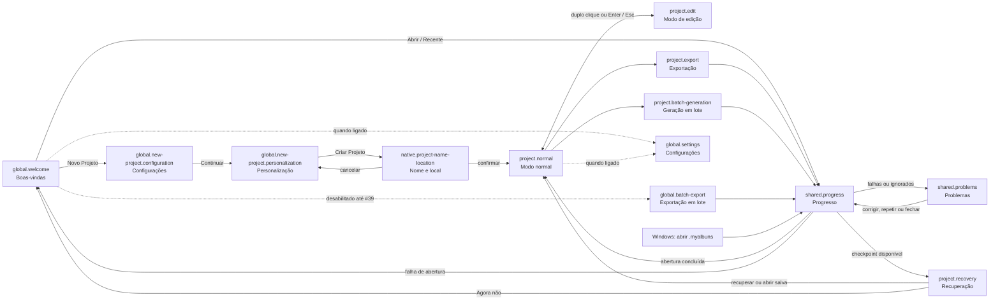

# Mapa de navegação e interação da interface

## Autoridade e leitura

Este documento é o mapa canônico, navegável e versionado das superfícies do
MyAlbuns. Ele une nomes visíveis, modos, transições e ownership sem substituir
os contratos detalhados dos designs [0001](0001-estrutura-da-janela-do-projeto.md)
a [0009](0009-configuracoes-do-aplicativo.md). O
[protótipo navegável](../../ui-architecture-prototype.html) é a prova executável
dos gestos que ainda não pertencem ao produto integrado; o
[manifesto de aceitação visual](../../src/test/uiAcceptanceScenarios.json)
identifica os fluxos reproduzíveis.

A referência visual vigente continua sendo somente o pacote
[Programa de diagramação](../references/ui-programa-diagramacao/README.md). Uma
decisão aceita posterior prevalece sobre a imagem quando houver divergência.
Em especial:

- a primeira etapa de Novo Projeto chama-se `Configurações`, não `Dimensões`;
- Configurações e Ajuda não aparecem na Boas-vindas enquanto não possuírem uma
  ligação funcional nessa superfície;
- Exportação em lote permanece desabilitada até o owner #39 integrá-la;
- Geração em lote parte somente de uma Janela do Projeto;
- a abertura direta de `.myalbuns` pelo Windows pode entrar no Projeto sem
  passar pela Boas-vindas.

O fixed point que originou esta consolidação é
`73b66d726ceb359f57f6cdeea3fbdd2ca484f46e`.

## IDs estáveis e superfícies

| ID estável | Nome visível e fonte navegável | Runtime owner | Owner de implementação | Estado atual |
| --- | --- | --- | --- | --- |
| `global.welcome` | [Boas-vindas](0002-tela-de-boas-vindas.md) | processo global | #13 | integrada; não oferece Configurações/Ajuda sem ligação |
| `global.new-project.configuration` | [Novo Projeto — Configurações](0003-criacao-de-projeto.md) | Boas-vindas | #9 | integrada |
| `global.new-project.personalization` | [Novo Projeto — Personalização](0003-criacao-de-projeto.md) | Boas-vindas | #21 | integrada |
| `native.project-name-location` | [Nome e local](0003-criacao-de-projeto.md) | diálogo nativo pertencente à Boas-vindas | #13 | abre somente após `Criar Projeto` |
| `project.normal` | [Janela do Projeto — Modo normal](0001-estrutura-da-janela-do-projeto.md) | Janela do Projeto | #9 | integrada em cortes incrementais |
| `project.edit` | [Janela do Projeto — Modo de edição](0001-estrutura-da-janela-do-projeto.md) | Janela do Projeto | #20 e #22 | contrato aceito e protótipo verificável |
| `project.recovery` | [Recuperação de sessão](../specs/programa-de-diagramacao-de-albuns.md#identidade-sessão-e-persistência) | tentativa Global de abertura e Host pendente correlacionado | #15 | a janela externa de progresso transiciona para a decisão antes de existir Janela do Projeto |
| `project.export` | [Exportação](0004-exportacao-normal.md) | Janela do Projeto originadora | #35 | contrato aceito; resultados pertencem à tentativa |
| `global.batch-export` | [Exportação em lote](0006-configuracao-da-exportacao-em-lote.md) | processo global exclusivo | #39 | desabilitada até integração |
| `project.batch-generation` | [Geração em lote](0008-configuracao-da-geracao-em-lote.md) | Janela do Projeto originadora | #36 | acessível somente pelo Projeto |
| `shared.problems` | [Problemas](0005-tela-de-problemas.md) | tentativa originadora | owner da operação | superfície pertencente, nunca global autônoma |
| `shared.progress` | [Progresso](0007-progresso-de-operacoes.md) | tentativa originadora | owner da operação | superfície pertencente, nunca histórico de trabalhos |
| `global.settings` | [Configurações do aplicativo](0009-configuracoes-do-aplicativo.md) | processo global | #12, #16 e #23 | ligação funcional ainda pertence aos owners |

`Runtime owner` indica quem mantém foco, bloqueio e retorno da superfície.
`Owner de implementação` indica o ticket que pode mudar seu contrato sem
reabrir o Programa 05.

## Grafo de navegação

Problemas e Progresso retornam sempre à proprietária da tentativa. As setas
para essas superfícies não criam um owner global compartilhado.

## Transições normativas

| Origem | Gatilho | Destino | Guarda e efeito | Cancelamento ou falha |
| --- | --- | --- | --- | --- |
| Boas-vindas | `Novo Projeto` | Configurações | abre o fluxo sem criar arquivo | `Cancelar` retorna à Boas-vindas |
| Configurações | `Continuar` | Personalização | preserva os valores válidos | `Voltar` retorna a Configurações |
| Personalização | `Criar Projeto` | Nome e local | abre diálogo nativo pertencente | cancelar preserva o formulário e não cria arquivo |
| Boas-vindas ou Windows | abrir Projeto | Progresso de abertura | a origem é retirada apenas nessa operação | falha restaura a origem atrás do diálogo pertencente |
| Progresso de abertura | checkpoint disponível | Recuperação | a mesma janela externa pertencente à Global muda de progresso para decisão; o Host fica correlacionado e a Janela do Projeto ainda não existe/não é exibida | `Esc` ou `Agora não` preserva o checkpoint e restaura a Global; fechar/falhar recolhe diálogo e Host sem duplicar Sessão |
| Recuperação | `Reabrir e recuperar` | Modo normal | cria uma sessão não salva no mesmo Host, uma única vez | falha mantém terminal explícito e não abre segunda sessão |
| Recuperação | `Abrir última versão salva` | confirmação no mesmo modal e Modo normal | só descarta o checkpoint após confirmação e sucesso | cancelar retorna à decisão; falha não descarta por aproximação |
| Modo normal | duplo clique na Lâmina ou `Enter` | Modo de edição | isola a Lâmina, fecha/suspende Barra e Layouts e inicia em `Ajustar Lâmina` | `Esc` descarta `ViewportTransform`, restaura painéis e centraliza a Lâmina |
| Modo normal | arrastar pela Barra ou Grade | prévia local de reordenação | somente a superfície originadora mostra placeholder, ghost e deslocamento | `Esc` ou drop inválido restaura; drop válido comita uma ação e sincroniza a outra superfície |
| Modo normal | `Exportar` | Exportação | pertence à Janela do Projeto | cancelar/fechar retorna ao mesmo Projeto |
| Modo normal | Geração em lote | Configuração de lote | exige Projeto modelo e exclusividade | cancelar retorna ao mesmo Projeto |
| operação | início mensurável | Progresso | pertence e bloqueia somente a proprietária prevista | sucesso fecha; falhas/ignorados seguem para Problemas |
| Problemas | corrigir/repetir | nova tentativa ou Progresso | usa o mesmo owner da operação | fechar retorna à proprietária |

## Modos e ownership da interação do editor

### Modo normal

- O Canvas contínuo mantém todas as Lâminas interativas e sem Zoom manual.
- As teclas físicas `←` e `→` centralizam a Lâmina física anterior e seguinte pelo catálogo público de comandos. Não existem botões permanentes de anterior/próxima nos cantos; controles editáveis, diálogos, menus, Modo de edição e gestos com semântica própria conservam ownership do teclado.
- A roda navega horizontalmente sobre toda a superfície e Barra da Lâmina, sem zona morta assimétrica; um controle só a retém quando possui semântica específica de wheel.
- Abrir ou dispensar o menu contextual não navega, seleciona ou centraliza. O alvo clicado permanece explícito para seus comandos, independentemente da Lâmina centralizada.
- Barra da Lâmina e Grade iniciam a mesma operação de reordenação, mas não compartilham a semântica do clique: a Barra seleciona/ativa sem navegar nem alterar `viewport.offsetX`, enquanto a Grade centraliza a Lâmina.
- Clique sem vencer o limiar de arraste aplica a semântica da superfície originadora; somente depois do
  limiar surgem placeholder, ghost e deslocamento intermediário. Soltar fora da
  superfície originadora ou receber `pointercancel` cancela sem commit. Barra e
  Grade usam eventos de ponteiro e captura real; o ghost acompanha o ponteiro e
  o auto-scroll continua atualizando destinos nas respectivas bordas.
- A ordem confirmada não muda durante a prévia. A representação oposta não
  anima e só sincroniza no drop válido.
- Reordenação e demais comandos estruturais pertencem ao owner #9.

### Modo de edição

- A Lâmina isolada inicia em `Ajustar Lâmina`. A `ViewportTransform` pertence à
  interface, não ao Projeto, Histórico ou Exportação.
- `Ctrl` + `+`, `Ctrl` + `−` e `Ctrl` + roda alteram o Zoom; `Ctrl` + `0`
  retorna ao ajuste. Teclado ancora no centro e roda ancora sob o cursor: a
  `ViewportTransform` recalcula o deslocamento para que o mesmo ponto da
  Lâmina permaneça sob o cursor, inclusive após gestos sucessivos.
- `Ajustar Lâmina` é o mínimo e **`4× Ajustar Lâmina` é o teto calibrado**. O
  valor é limitado por clamp, não cria controle ou percentual permanente e é
  descartado ao sair. A calibração mantém uma faixa útil para examinar bordas e
  alças sem permitir crescimento ilimitado da cena; seu owner contínuo é #22.
- Clique simples substitui a Seleção de Frames; `Ctrl` + clique adiciona ou
  remove. Valores divergentes mostram `—` para número, amostra vazia para cor e
  estado neutro para escolhas binárias. A primeira edição absoluta aplica o
  mesmo valor a todos os Frames compatíveis.
- Um Frame selecionado destravado possui caixa e oito alças. Movimento e resize
  são prévias locais e comitam uma ação por gesto válido.
- Em `Layout travado`, a seleção e sua caixa permanecem, as alças desaparecem e
  mover/redimensionar não alteram geometria nem Histórico.
- Edição de Frames e criação manual pertencem ao owner #20; projeção de
  `ViewportTransform` e valores mistos pertencem ao owner #22.

## Decisões calibradas e owners

Não é necessário criar um novo ticket para as duas decisões que estavam
pendentes:

1. **Teto do Zoom:** `4× Ajustar Lâmina`, com mínimo no ajuste, clamp nas duas
   extremidades, `Ctrl` + `0` e descarte na saída. O owner é
   [#22 — Programa 18](https://github.com/W4liss0n/my-Albuns/issues/22).
2. **Geometria inicial do Frame manual:** proporção `3:2`, largura de `40%` da
   superfície ativa e redução somente quando a altura disponível exigir. A
   decisão já foi aceita no
   [design 0017](0017-contrato-da-primeira-composicao-com-foto.md) e exercitada
   pelo domínio; o owner que a reutiliza na criação manual é
   [#20 — Programa 17](https://github.com/W4liss0n/my-Albuns/issues/20).

Em Lâmina dupla, a superfície ativa é a Lâmina inteira; em Página única, é a
Página ativa. Todos os caminhos de criação proporcional reutilizam o mesmo
contrato, sem tamanho físico fixo.

## Registro versionado de validação

Os IDs abaixo são contratos públicos do manifesto. O gate captura a fonte
renderizada e uma revisão explícita posterior decide `accepted`, `rejected` ou
`unvalidated`; captura isolada não equivale a aprovação.

| Fluxo | Cenários do manifesto |
| --- | --- |
| mapa e nomes atuais | `ui-architecture-map` |
| entrada/saída do Modo de edição | `canvas-sheet-editing`, `canvas-sheet-editing-exit` |
| Zoom por teclado, roda, reset e teto | `editor-zoom-keyboard-in`, `editor-zoom-keyboard-out`, `editor-zoom-wheel`, `editor-zoom-reset`, `editor-zoom-cap` |
| comandos de estrutura física e alvo contextual explícito | `sheet-structure-application-menu`, `sheet-structure-context-menu`, `canvas-context-menu-surface-preserves-viewport` |
| navegação física sem botões permanentes | `canvas-keyboard-next-sheet`, `canvas-keyboard-previous-sheet` |
| roda sobre a Barra inteira | `canvas-wheel-sheet-bar-forward`, `canvas-wheel-sheet-bar-backward` |
| reordenação pela Barra | `sheet-reorder-bar-preview`, `sheet-reorder-bar-commit`, `sheet-reorder-cancelled` |
| reordenação pela Grade | `sheet-reorder-grid-preview`, `sheet-reorder-grid-commit`, `sheet-reorder-invalid-target-preview`, `sheet-reorder-invalid-drop` |
| seleção semântica de texto | `project-text-selection-policy`, `new-project-operational-failure-dialog` |
| Recuperação em diálogo externo do fluxo de abertura | `project-recovery-modal` |
| splitters finos e alvo interativo | `project-splitters-normal-100`, `project-splitter-horizontal-hover-125`, `project-splitter-vertical-focus-150`, `project-splitters-resized` |
| seleção múltipla e mistos | `frame-multi-selection-mixed`, `frame-multi-selection-absolute-edit` |
| mover, redimensionar e travar | `frame-manipulation-move`, `frame-manipulation-resize`, `frame-layout-locked` |

As provas geradas ficam em `.scratch/ui-acceptance/` e são deliberadamente
ignoradas pelo Git. O manifesto, este mapa, o protótipo e seus testes permanecem
versionados; o relatório registra o commit exato capturado e se a árvore estava
limpa.

## Limite desta consolidação

O protótipo não emite `ProjectIntent`, não altera `ProjectCore`, não simula
persistência e não declara prontas as funcionalidades de domínio dos owners #9,
#20 ou #22. Ele preserva os contratos produtivos atuais e prova somente
arquitetura, interação e estados necessários ao fechamento do Programa 05.
