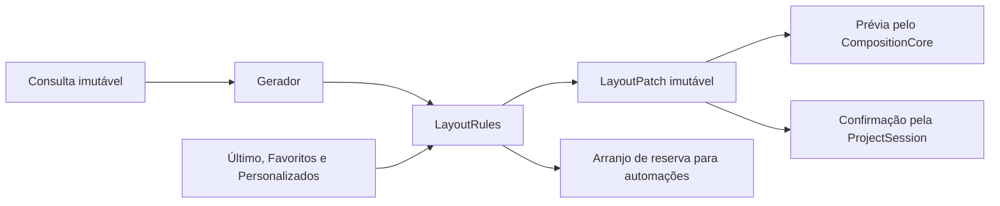

# Contrato do Gerador e da aplicação de Layouts

Este contrato consolida a base visual e comportamental aprovada na versão 9
do protótipo. Define a consulta do Gerador e o que a aplicação precisa
preservar ao consumir uma sugestão. Não afirma que o algoritmo ou o Painel
de Layouts já estejam implementados no aplicativo.

A decisão é do [ADR 0010](../adr/0010-gerar-layouts-por-composicoes-deterministicas.md).
A [SPEC](../specs/programa-de-diagramacao-de-albuns.md#layouts) possui o
comportamento observável; o [ADR 0008](../adr/0008-garantir-layout-compativel-por-arranjo-de-reserva.md)
possui a garantia das automações; o
[design do núcleo](0012-propriedade-de-estado-e-modulos-do-nucleo.md)
possui a sessão e suas responsabilidades.

## Responsabilidades

| Responsável | Contrato |
| --- | --- |
| Gerador de Layouts | Recebe uma consulta imutável e devolve de zero a dez geometrias ordenadas; concentra famílias, classificação e diversidade |
| `LayoutRules` | Resolve compatibilidade, identidade, prioridade entre origens, Mapeamento, arranjo de reserva e `LayoutPatch` |
| `ProjectSession` | Valida a revisão vigente e confirma o patch como um comando de Histórico |
| `CompositionCore` | Recalcula o enquadramento com o caminho já compartilhado por editor e Exportação |
| Interface | Mantém alvo, hover e seleção transitórios; apresenta a geometria resolvida pelo núcleo |

O Gerador não abre arquivos, não consulta Cache, não mantém sessão, não salva
catálogo e não confirma escolhas. A busca e suas famílias ficam internas
ao mesmo módulo; não há uma interface pública para cada família.

## Consulta

A operação conceitual é `generate(query) -> result`. O adaptador da sessão
constrói a consulta a partir do estado autoritativo; não aceita uma lista
de Frames reconstruída independentemente pelo frontend.

| Campo | Regra |
| --- | --- |
| Superfície | Tipo `singlePage` ou `doubleSheet`, largura e altura físicas da área ativa |
| Perfis dos Frames | Lista na ordem atual da Pilha visual; a quantidade é derivada da lista |
| Orientação | Vertical, horizontal ou quadrada, derivada das dimensões externas do Frame |
| Permissão | `pagesOnly` ou `pagesAndSheet`; Página única admite somente o primeiro comportamento |
| Margem | Distância física mínima das bordas da composição à superfície ou à sua Página |
| Intervalo | Distância física entre Frames vizinhos de um grupo |
| Menor lado | Dimensão física mínima de um Frame gerado |

IDs de Projeto, Lâmina e Frame pertencem ao contexto da consulta na sessão,
não à geometria reutilizável. Trocar apenas esses IDs não muda os resultados
do Gerador. A ordem dos perfis é relevante: VHV e VVH podem exigir listas
ordenadas diferentes, ainda que tenham as mesmas contagens.

Vertical significa largura menor que altura; horizontal, largura maior;
quadrado, medidas iguais. A primeira versão conserva quadrados como
quadrados, sem convertê-los silenciosamente em V ou H. A referência de
proporção para a classificação é 2:3, 3:2 ou 1:1. A razão da Foto, EXIF,
Giro, Ângulo, Pan, Zoom e efeitos não alteram a orientação de um Frame já
existente nem fazem parte da consulta inicial do Gerador.

Criar um Frame continua sendo responsabilidade do fluxo de edição. O
perfil só pode ser consultado depois de existir uma geometria inicial
válida. O retângulo temporário de 1 × 1 µm usado hoje durante a inserção
normal não representa uma decisão de criar um Frame quadrado e não pode
ser usado como perfil do Gerador. A integração deve atribuir a geometria
inicial pelo mesmo caminho da criação manual antes de solicitar organização.

O primeiro perfil de geração usa margem de 15 mm, intervalo de 5 mm e menor
lado de 20 mm, como o experimento aprovado. São parâmetros explícitos da
consulta, não constantes espalhadas por chamadores. A apresentação e a
persistência de controles para esses parâmetros pertencem à integração do
Painel, sem introduzir controles técnicos de pesos ou famílias no produto.

## Resultado e geometria

| Resultado | Significado |
| --- | --- |
| `candidates` | Uma a dez sugestões válidas, ordenadas |
| `empty` | Consulta sem Frames; não há organização a aplicar |
| `noCandidates` | A busca não encontrou um padrão que satisfaça as restrições |
| `outsideCoverage` | Quantidade acima de 30; preserva todos os Frames e permite que `LayoutRules` use outras origens ou a reserva |
| `invalidQuery` | Medidas inválidas, orientação desconhecida, margem/intervalo negativos ou menor lado não positivo |

O intervalo de 1 a 30 é a cobertura inicial do Gerador, não um limite para
editar Frames no produto. Restrições válidas que não deixam espaço suficiente
produzem `noCandidates`, sem relaxar orientação, margens ou espaçamento.
Esse resultado não prova impossibilidade matemática.

As medidas da consulta são inteiros em micrômetros, com os limites físicos
já aceitos pelo núcleo. A validação ocorre antes da classificação como
consulta vazia ou fora da cobertura. Página única trata ambas as permissões
como somente por Página, sem produzir uma travessia artificial.

Cada sugestão contém uma definição reutilizável e sua origem automática.
A definição possui tipo e tamanho de superfície de referência, escopo
inferido e uma lista ordenada de retângulos. Os retângulos usam a unidade
canônica do núcleo, micrômetros. Não contêm IDs dos Frames, Fotos, estilos,
Background, Overlay, seleção ou estado de enquadramento.

Versão do algoritmo, família e nota são metadados da geração. Uma geometria
favoritada ou guardada como Último Layout não precisa executar essa versão
novamente para ser usada. Sua cópia contém tudo que a aplicação necessita.

As posições retornam na ordem dos perfis recebidos. O Gerador pode escolher
qual Frame fica à esquerda, à direita, acima ou abaixo; isso não reordena a
Pilha visual. `LayoutRules` mantém o Mapeamento canônico `posição i ← Frame i`.

O cálculo pode usar geometria normalizada internamente. A geometria física
definitiva é resolvida e validada antes de aparecer na prévia. Arredondamentos
ocorrem nas bordas compartilhadas, nunca acumulando erros por Frame. Uma
diferença de até 1 µm por borda é admitida na conversão numérica; ela não pode
criar sobreposição, Travessia central, inversão V/H ou um Frame degenerado.
Prévia e confirmação recebem exatamente os mesmos retângulos finais.

## Permissão e escopo efetivo

`pagesAndSheet` reúne candidatos por Página e da superfície conjunta antes
da seleção. `pagesOnly` exclui qualquer candidato com Travessia central.
A lista combinada compartilha o teto de dez; não há cota fixa por tipo.

O tipo efetivo é inferido da geometria. A família de origem não autoriza
rotular como por Lâmina um candidato sem travessia. No Gerador, um candidato
classificado por Página também deve satisfazer as invariantes de blocos
independentes e centralizados em cada lado. Candidatos da superfície conjunta
que não atravessem o centro passam por essa verificação antes da classificação
e da seleção; uma geometria rejeitada não eleva o corte de qualidade das demais.

Essa verificação detectou um limite da V9: em 600 × 240 mm com 5 V + 3 H,
um candidato da família de grupos não atravessava o centro, mas deixava seus
blocos deslocados em 6,25 mm e margem interna de 2,5 mm, com 15 mm solicitados.
Ele é um exemplo negativo do contrato, não uma geometria a copiar para a
produção. Rejeitá-lo antes da seleção permite escolher candidatos por Página
que já respeitam as margens e a centralização, sem esticar seus Frames.

Para uma Lâmina dupla por Página, cada lado usa metade da largura total.
A margem interna de cada Página é pelo menos a margem pedida e metade do
intervalo, o que mantém também a separação entre Frames de lados opostos.
Cada bloco é centralizado horizontal e verticalmente em sua área útil.
Com dois ou mais Frames, o perfil inicial distribui pelo menos um em cada
Página. Com um Frame, pode ocupar um dos lados; espelhados são variações válidas.

Uma Página única usa coordenadas locais à área ativa, começando em `(0, 0)`.
O lado esquerdo ou direito da extremidade é resolvido pelo núcleo ao compor;
o Gerador não cria uma Página inativa nem acrescenta seu deslocamento.

A permissão do Projeto aplica-se também ao Último Layout, Favoritos e
Personalizados. Exportar por Página não altera essa permissão: a Exportação
já possui sua própria regra de recorte de Frames atravessados.

## Invariantes das sugestões geradas

- Todos os perfis aparecem uma única vez e conservam V/H ou a forma quadrada.
- Retângulos finitos e positivos respeitam a superfície, a margem e o menor lado.
- Frames não se sobrepõem; cada grupo mantém alinhamentos e intervalos uniformes.
- Não há células vazias dentro dos grupos. Margens, intervalos e espaço externo
  de um bloco centralizado continuam permitidos.
- Grades uniformes e trilhas repetidas são excluídas segundo o perfil aprovado.
- Em Layouts por Página, nenhum Frame atravessa o centro e cada bloco é centralizado.

Essas exigências estéticas pertencem às sugestões do Gerador. Elas não
invalidam um Layout personalizado criado a partir da composição manual,
nem acrescentam restrições ao arranjo de reserva do ADR 0008.

## Busca, classificação e diversidade

A primeira versão parte das famílias aprovadas: composições pequenas,
faixas, colunas, bandas com tamanhos graduados, destaque e apoio, grupos
complementares e combinações por Página. A enumeração usa somente grades
completas e repartições definidas. O algoritmo não sorteia retângulos.

O perfil numérico inicial mantém a V9: 45% de afinidade de proporção, 40%
de ocupação e 15% de tamanho; nota mínima de 72 e até dez pontos abaixo da
melhor. Preserva as penalidades de dominância, contraste e desequilíbrio
por Página, além dos limites de enumeração documentados no protótipo.
Os pesos são detalhes versionados da implementação; não passam a integrar
o documento de Projeto ou o formato de um Layout salvo.

O perfil inicial fixa estes limites para que a portabilidade não dependa
de reconstruir escolhas a partir das imagens do protótipo:

| Parâmetro interno | Valor inicial |
| --- | --- |
| Proporções admitidas | V de 0,45 a 0,92; H entre os recíprocos; quadrados em 1:1 |
| Faixas regulares | Até quatro bandas; quantidades repetidas por orientação |
| Bandas graduadas | Para quatro ou mais Frames, até quatro bandas de até quatro Frames, no máximo três da mesma orientação em cada banda; quantidades não decrescentes |
| Mais de 12 da mesma orientação | Até quatro bandas; quantidades não decrescentes e no máximo metade do total arredondada para cima em uma banda |
| Destaque | Fração 1/3, 0,4, 0,5, 0,6 ou 2/3 da dimensão livre; área pelo menos 1,5 vez a do maior apoio |
| Grupos complementares | Para oito ou mais Frames; duas regiões em 40/60, 50/50 ou 60/40; primeiro grupo com três, metade arredondada para baixo ou total menos três |
| Candidatos locais | Até quatro por região de grupo complementar; até seis por Página para cada distribuição de orientações |
| Afinidade de proporção | Média de `min(proporção / referência, referência / proporção)` |
| Ocupação | Área dos Frames dividida pela área útil externa; normalizada por 0,86 e limitada a 1 |
| Tamanho | Menor lado dividido por duas vezes o mínimo pedido, limitado a 1 |
| Desequilíbrio por Página | Subtrair até seis pontos conforme a diferença entre as áreas ocupadas dos lados |
| Dominância, em grupos com ao menos cinco Frames | Subtrair `min(12, max(0, maior área / soma das áreas − 0,4) × 35)` |
| Contraste, em grupos com ao menos cinco Frames | Subtrair `min(10, max(0, maior área / menor área − 6) × 1,2)` |

Dominância e contraste são avaliados separadamente em cada Página quando
esse for o escopo. A comparação de tamanhos para repetição admite diferença
de 4%. Rejeita todos os Frames iguais em um conjunto de quatro ou mais,
quatro ou mais iguais cobrindo ao menos 75% do conjunto, duas metades
idênticas por translação e trilhas repetidas que cubram todo o conjunto
ou 75% dele quando houver ao menos três trilhas.

Uma orientação com quatro ou mais Frames exige relação de área maior/menor
de pelo menos 1,35. Em conjuntos de seis ou mais, rejeita a ausência dessa
variação em todas as orientações. Também rejeita cinco Frames iguais
alinhados junto a um Frame com pelo menos 2,5 vezes a área de cada um.
Esses filtros concretizam o perfil aprovado; novas versões podem afiná-los
sem alterar a definição persistida de um Layout já escolhido.

A seleção incremental combina 85% de nota e 15% de novidade geométrica.
A novidade mínima de 0,25 é comparada somente com sugestões do mesmo
escopo efetivo. Assim, a semelhança de posições não elimina a escolha
entre atravessar ou preservar o centro. Permanecem os limites de até duas
opções por família simples e quatro por direção dos grupos complementares;
combinações por Página usam a diversidade geométrica.

A novidade inicial usa `1 − média das interseções sobre uniões` entre
retângulos da mesma orientação, emparelhados sem reutilização na ordem dos
perfis. Cada retângulo escolhe o maior valor disponível; empate conserva
a primeira posição. A novidade em relação à seleção é a menor dessas
distâncias; sem sugestão anterior do mesmo escopo, vale 1.

Empates usam a representação geométrica normalizada em ordem estável.
Nenhuma decisão depende da ordem de um mapa hash, do relógio ou do tempo
que a máquina levou. A mesma consulta e versão produzem o mesmo resultado.
Renomear IDs, mudar DPI ou Unidade de apresentação não muda a consulta.
Escalar conjuntamente superfície, margem, intervalo e menor lado conserva
a composição normalizada, dentro da quantização física declarada.

Espelhamentos e troca das Páginas são variações legítimas. O agrupamento
de espelhados usado na demonstração não altera a identidade de Layouts.
Na primeira integração, esses candidatos participam da seleção normal;
não há filtro de apresentação obrigatório herdado do HTML.

## Compatibilidade, prioridade e reserva

Compatibilidade exige o mesmo tipo e proporção de superfície, permissão
de escopo e quantidade aplicável. Layouts existentes podem ser escalados
proporcionalmente; DPI e Unidade não criam outra identidade. A identidade
usa escopo, tipo/proporção e sequência ordenada de retângulos normalizados.
Trocar posições entre índices continua representando outra definição.

Preservar V/H é uma invariante da geração de sugestões para os perfis
consultados. Não acrescenta um filtro retroativo ao Último Layout ou aos
Personalizados: reaplicar um Layout continua recuperando a geometria
original, mesmo depois de uma edição manual dos Frames.

Dentro de cada seção, a ordem é Último Layout compatível, Favoritos e demais
candidatos. A nota do Gerador não ultrapassa essa prioridade. Uma definição
tem uma única preview, mesmo quando veio de mais de uma origem.

A prioridade de aplicação automática é Último Layout, primeiro Favorito,
primeiro Personalizado e primeira sugestão do Gerador. Sem opção nessas
origens, `LayoutRules` produz a reserva derivada da quantidade e superfície
ativa. Ela pode sempre respeitar o escopo mais restritivo, sem consultar
Foto, orientação, prévia ou escolhas anteriores. Não aparece no painel,
não pode ser favoritada e não substitui o registro do Último Layout aplicado.

Sem Frames, a Lâmina permanece vazia. Uma consulta vazia do Gerador não deve
ser confundida com uma falha da garantia de reorganizar Frames existentes.

## Prévia e confirmação

1. A sessão captura Lâmina alvo, revisão vigente, ordem e IDs dos Frames e
   parâmetros aplicáveis. O painel guarda um identificador dessa consulta.
2. Consultar candidatos não modifica Projeto, Salvamento ou Histórico.
3. `LayoutRules` resolve compatibilidade, escala e Mapeamento para produzir
   um `LayoutPatch` imutável. A prévia usa `CompositionCore` com esses retângulos.
4. O hover mostra os próprios Frames, incluindo placeholders, Fotos, estilos
   herdados/próprios e ajustes. Troca de hover substitui a prévia; saída a descarta.
5. O clique leva a mesma definição e revisão à fila de mutações. Com revisão,
   alvo ou ordem divergentes, a operação é recusada como prévia desatualizada
   e a consulta é renovada. Não se aplica silenciosamente uma nova geometria.
6. Somente `ProjectSession` confirma. Geometria, Último Layout e eventual
   travamento mudam juntos em uma ação de Undo/Redo.

O Gerador inicial produz a quantidade exata. Posições excedentes de candidatos
de travamento vêm de definições apropriadas de outras origens ou consultas
explícitas futuras. O corpo da preview não confirma esses excedentes; somente
o cadeado cria placeholders e trava, seguindo a SPEC. A busca comum não inventa
Fotos ou orientações futuras para preencher dez sugestões.

## Persistência e integração existente

O Projeto guarda a geometria aplicada, a cópia do Último Layout e as cópias
dos Favoritos; não guarda estado da busca. Configuração da permissão de Layouts
precisa acompanhar o Projeto. Projetos anteriores preservam a capacidade de
usar ambos os tipos na migração. Alterar a permissão muda as opções elegíveis,
sem reorganizar silenciosamente uma composição já existente.

A próxima implementação deve substituir a chamada privada
`apply_first_compatible_layout` em `project_document.rs`, que hoje constrói
uma grade diretamente, por uma consulta a `LayoutRules`. A transição exige
testar inserção normal, exclusão, conversão de extremidade e Histórico.
Não basta portar a função JavaScript e chamá-la do frontend.

O formato persistido para Último Layout, Favoritos e permissão deve ser
introduzido em uma versão própria de schema, com migração e reabertura
verificadas pelos testes públicos de `ProjectCore`. O schema atual não é
alterado por este documento.

## Evidência preservada e critérios de integração

O protótipo permanece na branch `codex/prototype-layout-generator`:

- `6a3d68f`: código e exemplos da V9;
- `474771f`: registro da aprovação do autor;
- `crates/myalbuns-core/prototypes/layout-generator.prototype.html`:
  fonte executável e casos guiados;
- `docs/design/0025-proposta-gerador-de-layouts.md`: decisões e medições do experimento.

O [corpus de referência](../../crates/myalbuns-core/tests/fixtures/layouts/generator-v1.json)
conserva consultas e geometrias do experimento que atendem às invariantes
de integração. Ele não exige copiar todos os índices da lista demonstrativa:
há casos negativos para erros já encontrados e para candidatos sem travessia
que não centralizam seus blocos. As posições da referência usam micrômetros,
com tolerância de 1 µm por borda ao comparar uma implementação numérica.

| Verificação na implementação | Resultado exigido |
| --- | --- |
| Repetir consulta, renomear IDs, converter Unidade/DPI | Mesma geometria e ordem |
| 1, 3, 4, 5, 8, 12, 15, 20 e 30 Frames; superfícies variadas | Sugestões dentro das invariantes ou ausência explícita |
| Mais de 30 Frames | `outsideCoverage`; sem truncamento de Frames nem falha das automações |
| 2 V + 1 H em 600 × 240 mm | A opção por Página não é excluída por parecer com uma que atravessa o centro |
| 5 V + 3 H e grupo de quatro verticais | Nenhuma grade de apoio incompleta |
| Lâmina dupla restrita | Zero travessias; blocos centralizados em cada Página |
| Fontes de candidatos vazias | Reserva válida para automações, sem preview ou Último Layout falso |
| Hover seguido de saída ou troca | Documento, revisão e Histórico intactos |
| Clique e Undo/Redo | Mesmos retângulos da prévia; conteúdo e estilo preservados |
| Comando concorrente ou troca de alvo | Resultado atrasado descartado; prévia desatualizada não é aplicada |
| Salvar, reabrir e exportar | Geometria aplicada e enquadramento equivalentes |

Os casos geométricos do corpus foram conferidos nesta etapa. Os testes da
implementação Rust e dos fluxos de sessão/painel continuam sendo gates da
integração, não evidência já obtida pelo protótipo. O ticket #25 pode consumir
definições versionadas por esse contrato antes da substituição pelo Gerador.
Os tickets de travamento, Personalizados e Favoritos conservam suas entregas.

O ticket #28 ainda descreve a sequência antiga, com decisão posterior ao #25.
Este contrato e o ADR registram a antecipação aprovada. O estado remoto das
issues não foi alterado nesta entrega; a implementação e sua validação
continuam separadas da conclusão desta etapa de definição.
