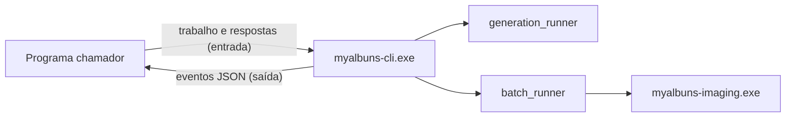
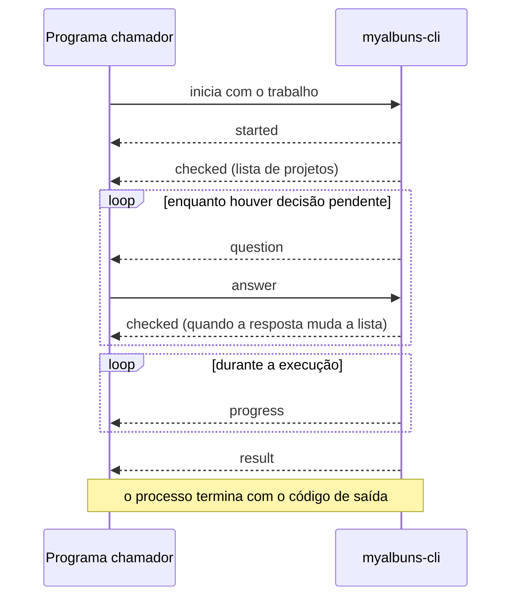

# Automação por linha de comando

`myalbuns-cli.exe` permite que outro programa gere projetos em lote e exporte em
lote sem abrir as janelas do myAlbuns. O programa chamador inicia o executável,
lê eventos em JSON na saída e responde às perguntas pela entrada.

Este documento é a referência completa: como obter o executável, como conversar
com ele, o que cada comando faz e o que ainda falta.

## Visão geral

O executável não reimplementa nenhuma regra. Ele usa os mesmos módulos das telas
“Gerar projetos em lote” e “Exportação em lote” e troca a janela por uma
conversa em linhas de texto.



Três ideias sustentam o desenho:

- **Perguntas com opções.** Quando falta uma decisão, o executável pergunta e
  lista as opções. O chamador mostra a pergunta à pessoa, ou decide sozinho, e
  devolve o identificador da opção.
- **Códigos para decidir, textos para mostrar.** O chamador decide pelo `code`
  da pergunta e pelo `id` da opção. `message` e `label` são textos em português
  para exibir e podem ser reescritos sem mudar o protocolo.
- **Um problema nunca derruba o lote.** O projeto com problema aparece no
  resultado com o motivo; os outros seguem.

O contrato é interno: serve a um programa do próprio autor. Os campos `version`
do trabalho e `protocol` do evento `started` existem para recusar combinações
incompatíveis, não para prometer estabilidade a terceiros.

## Como obter o executável

O executável é um segundo binário do pacote do aplicativo.

```
powershell -File scripts/Invoke-LocalCargo.ps1 build --package myalbuns-desktop --bin myalbuns-cli --release
```

O resultado fica em `target\release\myalbuns-cli.exe`. Sem `--release`, fica em
`target\debug\`.

- **A exportação precisa do Processador de Imagens.** `myalbuns-cli.exe` tem de
  ficar na mesma pasta de `myalbuns-imaging.exe`. A geração não precisa dele.
- **Instalador.** Ainda não foi confirmado que o instalador inclui o executável.
- **Dados do aplicativo.** O executável usa as mesmas pastas de dados do
  myAlbuns instalado: identidades de projeto, registros e retomadas de lote.
- **Dados isolados para testes.** Só na compilação de desenvolvimento, a
  variável `MYALBUNS_PROCESS_GATE_DATA_ROOT` aponta essas pastas para outro
  lugar. A compilação `--release` ignora a variável.

## Como chamar

```
myalbuns-cli <comando> --job <arquivo.json | -> [--non-interactive] [--dry-run]
```

| Comando | O que faz |
|---|---|
| `generate-batch` | Gera um projeto para cada pasta com fotos, a partir de um projeto modelo. |
| `export-batch` | Exporta todos os projetos de uma pasta e de suas subpastas. |

| Opção | Efeito |
|---|---|
| `--job <arquivo>` | Arquivo JSON com o trabalho. |
| `--job -` | Lê o trabalho da primeira linha da entrada. |
| `--non-interactive` | Não faz perguntas. Projetos com problema são ignorados e o que já existe é mantido, salvo quando o trabalho pede `"onExisting": "replace"`. |
| `--dry-run` | Só verifica. Emite `checked` e termina com `result` de status `checked`, sem perguntar nem gravar. |
| `--help`, `--version` | Mostram o uso e a versão. |

Regras do canal:

- Entrada e saída usam UTF-8, com um objeto JSON por linha.
- Leia só a saída padrão. A saída de erro traz mensagens de uso e, na
  compilação de desenvolvimento, linhas de registro.
- Campos desconhecidos no trabalho são recusados; campos novos nos eventos devem
  ser ignorados pelo chamador.

## Ciclo de uma sessão



Toda sessão termina com um evento `result` ou com um `error` de `fatal: true`.
Depois disso o processo encerra.

## Gerar projetos em lote

Cada pasta com fotos dentro de `sourceFolder`, incluindo subpastas, gera um
projeto com o nome da pasta. A organização das pastas é mantida no destino.

```json
{
  "version": 1,
  "model": "D:\\Modelos\\Formatura.myalbuns",
  "sourceFolder": "D:\\Fotos\\Turma A",
  "destinationFolder": "D:\\Projetos\\Turma A",
  "onExisting": "ask"
}
```

| Campo | Significado | Padrão |
|---|---|---|
| `version` | versão do trabalho; hoje `1` | obrigatório |
| `model` | projeto salvo que serve de modelo | obrigatório |
| `sourceFolder` | pasta com as pastas de fotos | obrigatório |
| `destinationFolder` | onde gravar os projetos; fora da origem e de suas subpastas | obrigatório |
| `onExisting` | `ask`, `skip` ou `replace` quando o projeto já existe no destino | `ask` |

Comportamento:

- São consideradas fotos os arquivos `jpg`, `jpeg`, `png`, `tif` e `tiff`.
- As fotos entram só no painel de imagens do projeto novo; as páginas vêm do
  modelo.
- O modelo é lido como está salvo no disco. Alterações ainda não salvas num
  editor aberto não entram, ao contrário da tela, que parte do projeto aberto.
- Até quatro projetos são gravados ao mesmo tempo.

Perguntas possíveis:

| `code` | Quando | Opções |
|---|---|---|
| `destination-exists` | já existe um projeto com esse nome no destino | `replace`, `skip`, `cancel` |
| `project-blocked` | o destino não pode ser usado: projeto aberto, sem permissão, nome ocupado por uma pasta | `retry`, `skip`, `cancel` |

`retry` verifica tudo de novo. A nova verificação cria itens com `id` novos e
volta a pedir confirmação para substituir.

## Exportar em lote

Todo arquivo `.myalbuns` dentro de `sourceFolder`, incluindo subpastas, é
exportado inteiro. Cada álbum vai para uma pasta com o nome do projeto.

```json
{
  "version": 1,
  "sourceFolder": "D:\\Projetos\\Turma A",
  "destinationFolder": "E:\\Exportações\\Turma A",
  "format": "jpeg",
  "mode": "sheet",
  "onExisting": "ask",
  "relink": ["F:\\Fotos movidas"]
}
```

| Campo | Significado | Padrão |
|---|---|---|
| `version` | versão do trabalho; hoje `1` | obrigatório |
| `sourceFolder` | pasta com os projetos | obrigatório |
| `destinationFolder` | raiz das exportações, mantendo as subpastas | ao lado de cada projeto |
| `format` | `jpeg`, `png` ou `pdf`; JPEG sai sempre em qualidade 100 | obrigatório |
| `mode` | `sheet` (lâminas) ou `page` (páginas simples) | `sheet` |
| `onExisting` | `ask`, `skip` ou `replace` quando já existe uma exportação | `ask` |
| `relink` | pastas onde procurar imagens ausentes antes de perguntar | nenhuma |

Com o exemplo acima, o projeto `Ana.myalbuns` gera
`E:\Exportações\Turma A\Ana\Ana_001.jpg`, `Ana_002.jpg` e assim por diante.

Perguntas possíveis:

| `code` | Quando | Opções |
|---|---|---|
| `missing-files` | imagens do projeto não foram encontradas | `relink` (pede uma pasta), `skip`, `retry`, `cancel` |
| `empty-frames` | o projeto tem quadros vazios | `retry`, `skip`, `cancel` |
| `invalid-project` | o arquivo não abre ou precisa ser salvo no aplicativo antes | `retry`, `skip`, `cancel` |
| `unavailable` | projeto, imagem ou destino inacessível | `retry`, `skip`, `cancel` |
| `changed` | o projeto mudou depois da verificação | `retry`, `skip`, `cancel` |
| `output-exists` | já existe uma exportação no destino; uma vez para o lote | `replace`, `skip`, `cancel` |
| `interrupted` | a exportação parou por cancelamento ou falha do Processador | `resume`, `end`, `keep` |
| `storage-full` | faltou espaço em disco | `resume`, `end`, `keep` |

Localizar imagens:

- A localização vale só para aquela exportação. O arquivo do projeto não é
  alterado.
- Respondendo `relink` para um projeto, a imagem é procurada pelo nome do
  arquivo em toda a pasta informada, e só é aceita se houver um único candidato.
- Com `applyToAll`, ou pelo campo `relink` do trabalho, a busca cobre todos os
  projetos, e a imagem precisa estar sob uma pasta com o nome do projeto.
- Se ainda faltarem imagens, a pergunta volta com um `id` novo e a lista do que
  falta.

Depois de uma parada:

- `resume` verifica de novo e continua de onde parou. O álbum interrompido é
  refeito.
- `end` descarta a retomada. Os arquivos já exportados ficam.
- `keep` encerra a sessão e guarda a retomada. O resultado traz `batchId`.

## Eventos emitidos

### `started`

```json
{"event":"started","protocol":1,"command":"export-batch"}
```

### `checked`

Emitido depois de cada verificação: no início, depois de localizar imagens e
depois de “Verificar novamente”.

```json
{"event":"checked","canContinue":false,"hasConflicts":false,"items":[
  {"id":"209b…","name":"Ana","projectPath":"D:\\Projetos\\Ana.myalbuns",
   "destination":"E:\\Exportações\\Ana","status":"pending",
   "problems":[{"code":"missing-files","message":"Imagem ausente: 001.jpg","fileName":"001.jpg"}]}
]}
```

| Campo | Significado |
|---|---|
| `canContinue` | nenhum projeto pendente tem problema |
| `hasConflicts` | algo já existe num destino e pede decisão |
| `items[].id` | identificador do projeto nesta verificação |
| `items[].name` | nome do projeto |
| `items[].projectPath` | caminho do projeto; só na exportação |
| `items[].destination` | arquivo ou pasta de destino |
| `items[].status` | `pending`, `completed`, `skipped` ou `failed` |
| `items[].problems[]` | `code`, `message` e, quando há, `fileName` |

Códigos de problema nos itens:

| Comando | Códigos |
|---|---|
| geração | `destination-exists`, `blocked`, `failed` |
| exportação | `missing-files`, `empty-frames`, `invalid-project`, `unavailable`, `changed`, `failed`, `output-kept` |

`output-kept` marca um álbum ignorado porque os arquivos existentes foram
mantidos.

### `question`

```json
{"event":"question","id":"q1","code":"missing-files",
 "message":"Uma imagem de Ana não foi encontrada. Escolha a pasta onde ela está.",
 "item":"209b…","name":"Ana","files":["001.jpg"],"remaining":1,
 "options":[
   {"id":"relink","label":"Localizar imagens…","input":"folder"},
   {"id":"skip","label":"Ignorar"},
   {"id":"retry","label":"Verificar novamente"},
   {"id":"cancel","label":"Cancelar"}]}
```

| Campo | Significado |
|---|---|
| `id` | identificador da pergunta; a resposta o repete |
| `code` | tipo da pergunta |
| `message` | texto para exibir |
| `item`, `name` | projeto a que a pergunta se refere; ausentes em perguntas do lote |
| `files` | arquivos envolvidos, quando há |
| `remaining` | outros projetos que esperam a mesma decisão |
| `options[].id` | valor a devolver |
| `options[].label` | texto do botão |
| `options[].input` | presente quando a resposta precisa de `value`; hoje só `folder` |

### `progress`

```json
{"event":"progress","completed":1,"total":2,"percent":55.0,
 "current":{"id":"adf1…","name":"Bia","percent":10.0}}
```

| Campo | Exportação | Geração |
|---|---|---|
| `completed`, `total` | álbuns concluídos e total | projetos concluídos e total |
| `percent` | avanço do lote inteiro | não vem |
| `current` | álbum em andamento, com `id`, `name` e o `percent` próprio | não vem |

Na exportação há um evento a cada 1% do álbum em andamento. No último evento
`current` não vem. Na geração há um evento por projeto concluído.

### `result`

```json
{"event":"result","status":"partial","items":[…]}
```

`items` tem o mesmo formato de `checked`, com o estado final de cada projeto.
`batchId` vem só no status `interrupted`.

### `error`

```json
{"event":"error","code":"relink-failed","message":"Não foi possível procurar as imagens nessa pasta. Confira se ela existe e tente novamente.","fatal":false}
```

Com `fatal: false`, um passo foi recusado e a sessão continua; a pergunta em
aberto segue valendo ou é refeita. Com `fatal: true`, a sessão terminou.

| `code` | `fatal` | Quando |
|---|---|---|
| `invalid-answer` | não | a resposta não corresponde à pergunta, à opção ou falta `value` |
| `invalid-input` | não | a linha recebida não é uma resposta nem um comando |
| `relink-failed` | não | a pasta informada não pôde ser lida |
| `job-unavailable` | sim | o arquivo do trabalho não pôde ser lido |
| `invalid-job` | sim | o trabalho não é JSON válido ou tem campo errado |
| `unsupported-job-version` | sim | `version` diferente da aceita |
| `application-unavailable` | sim | as pastas de dados do myAlbuns não foram encontradas |
| `model-unavailable` | sim | o projeto modelo não abre |
| `preparation-failed` | sim | a verificação inicial falhou: pasta inacessível, nada encontrado |
| `blocked` | sim | restaram projetos com problema sem decisão |
| `input-closed` | sim | a entrada fechou com uma pergunta pendente |
| `export-unavailable` | sim | o Processador de Imagens não pôde ser iniciado |
| `export-failed` | sim | a exportação não pôde começar ou parou sem retomada; inclui outra exportação em andamento |
| `resume-failed`, `end-failed` | sim | a retomada não pôde ser lida ou descartada |
| `failed` | sim | outra falha durante uma decisão |

## Linhas aceitas na entrada

Resposta a uma pergunta:

```json
{"answer":"q1","option":"relink","value":"E:\\Fotos\\Ana","applyToAll":false}
```

| Campo | Significado |
|---|---|
| `answer` | `id` da pergunta |
| `option` | `id` da opção escolhida |
| `value` | valor pedido por `input` |
| `applyToAll` | estende a opção aos projetos seguintes com a mesma pergunta |

Cancelamento, a qualquer momento:

```json
{"command":"cancel"}
```

- Durante uma pergunta, encerra a sessão.
- Durante a exportação, interrompe o álbum em andamento e leva à pergunta
  `interrupted`.
- Durante a geração, os projetos já iniciados terminam e os demais não começam.

## Resultado e código de saída

| `status` | Significado | Código |
|---|---|---|
| `checked` | `--dry-run` concluído | 0 |
| `completed` | todos os projetos concluídos | 0 |
| `partial` | algum projeto ignorado ou com falha | 2 |
| `cancelled` | cancelado, sem nada a retomar | 3 |
| `interrupted` | exportação parada com retomada guardada | 3 |
| erro fatal | evento `error` com `fatal: true` | 1 |
| argumentos inválidos | mensagem na saída de erro | 64 |

## Exemplo de programa chamador

O exemplo, em Python, mostra a estrutura mínima: iniciar, ler eventos, responder
às perguntas e acompanhar o progresso.

```python
import json
import subprocess

def executar(comando, trabalho, decidir):
    processo = subprocess.Popen(
        ["myalbuns-cli.exe", comando, "--job", "-"],
        stdin=subprocess.PIPE, stdout=subprocess.PIPE,
        encoding="utf-8",
    )

    def enviar(objeto):
        processo.stdin.write(json.dumps(objeto) + "\n")
        processo.stdin.flush()

    enviar(trabalho)
    for linha in processo.stdout:
        evento = json.loads(linha)
        tipo = evento["event"]
        if tipo == "question":
            # decidir mostra a pergunta e devolve {"option": ..., "value": ...}
            enviar({"answer": evento["id"], **decidir(evento)})
        elif tipo == "progress":
            atual = evento.get("current")
            if atual:
                print(f'{atual["name"]}: {atual["percent"]:.0f}%')
        elif tipo == "error" and evento["fatal"]:
            print("Erro:", evento["message"])
        elif tipo == "result":
            for item in evento["items"]:
                print(item["name"], item["status"])
    return processo.wait()
```

## Simultaneidade

- **Uma exportação por vez na máquina.** A trava é a mesma entre a linha de
  comando, a tela “Exportação em lote” e a exportação de um álbum aberto. Uma
  segunda exportação termina com `export-failed`.
- **Álbuns em sequência, trabalho em paralelo.** Os álbuns de um lote saem um
  de cada vez. Dentro de cada álbum, o Processador de Imagens usa várias threads
  para decodificar e compor.
- **Álbuns abertos ficam bloqueados** enquanto a exportação roda, como acontece
  com a tela de lote.
- **A geração não usa essa trava** e grava até quatro projetos ao mesmo tempo.

Para exportar muitos conjuntos, prefira um único trabalho apontando para a
pasta que contém todos, ou uma fila no programa chamador.

## Decisões

- **Executável separado, de console.** `MyAlbuns.exe` não tem saída padrão
  utilizável e trata um caminho `.myalbuns` como pedido para abrir o projeto.
- **Sessão conversada em vez de opções fixas.** As regras de conflito e de
  localização ficam num lugar só, e o chamador não as reimplementa.
- **Padrão conservador sem perguntas.** Nada é substituído e nenhum álbum é
  exportado incompleto sem pedido explícito.
- **Exportação pelo aplicativo sem janela.** O Processador de Imagens é iniciado
  e supervisionado pelo mesmo código das telas, com a mesma recuperação de
  falhas.
- **Retomadas compartilhadas.** Uma exportação guardada com `keep` fica onde a
  tela “Exportação em lote” procura, e pode ser retomada ou encerrada por ela.

## Pendências

- Confirmar que o instalador inclui `myalbuns-cli.exe`.
- Tratar Ctrl+C como cancelamento. Hoje ele encerra o processo, e uma exportação
  em andamento fica para retomar pela tela.
- Retomar ou encerrar pela linha de comando um lote guardado numa sessão
  anterior.
- Dar um código próprio à recusa por outra exportação em andamento.
- Informar o avanço da verificação inicial, que em pastas grandes ou em rede
  pode demorar sem emitir eventos.
- Verificar o comportamento com o aplicativo aberto e medir o uso de
  processador durante a exportação.

## Fontes

- `src-tauri/src/automation.rs`: sessão, eventos e argumentos
- `src-tauri/src/automation/generation.rs` e `src-tauri/src/automation/export.rs`
- `src-tauri/src/automation/tests.rs`
- `src-tauri/src/generation_runner.rs`
- `src-tauri/src/batch_runner.rs` e `src-tauri/src/batch_runner/relink.rs`
- `src-tauri/src/batch_exclusivity.rs` e `src-tauri/src/operation_gate.rs`
- `crates/myalbuns-imaging/src/album_render.rs`
