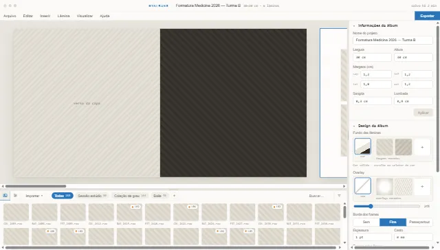

# Referência visual vigente

Este diretório contém a única base visual vigente do programa. O conteúdo foi
incorporado a partir de `UI de programa de diagramação.zip`, fornecido pelo
autor em 14 de agosto de 2026.

- SHA-256 do ZIP de origem:
  `524da2893e78abb43796182810cf8c3d16355d9a754234464d1cb84cece73da1`;
- editor e Painel contextual: [`myalbuns.dc.html`](./myalbuns.dc.html);
- Tela de Boas-vindas: [`Boas-vindas.dc.html`](./Boas-vindas.dc.html);
- criação de Projeto: [`Criar projeto.dc.html`](./Criar%20projeto.dc.html);
- Janelas auxiliares: [`Janelas.dc.html`](./Janelas.dc.html);
- diálogos: [`Modais.dc.html`](./Modais.dc.html).

O pacote define a base visual. Decisões posteriores já aceitas na especificação
ou nos documentos de design prevalecem em detalhes que foram refinados durante
a implementação, como o padrão de janela do Windows. Não devem ser adicionadas
capturas antigas como referências alternativas.
